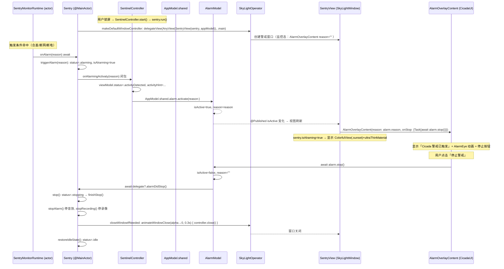
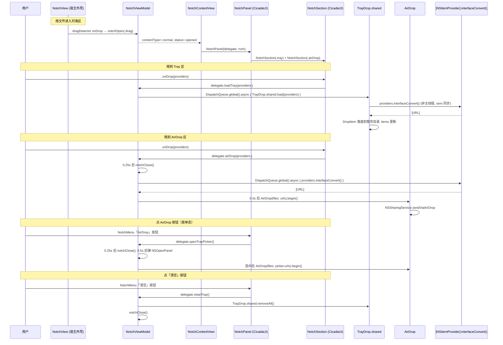
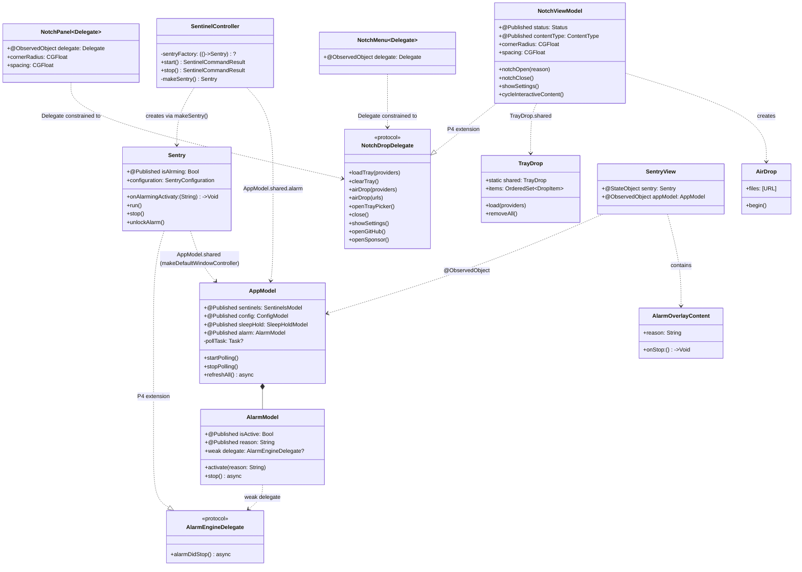
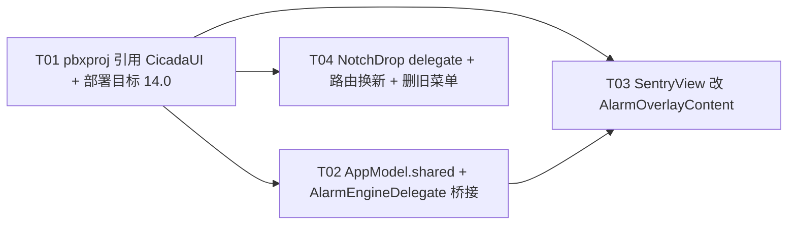

# Cicada P4 实施 Spec：Xcode 宿主接入 CicadaUI

> 架构师：高见远（Gao）
> 基线：`docs/P3-AlarmOverlay-NotchPanel-Spec.md` §5.2（留 Xcode 宿主动作清单）、`docs/Implementation-Plan-v2.md`、`.workbuddy/memory/MEMORY.md`
> 产出日期：2026-07-18
> 适用范围：P4——把 CicadaUI（SwiftPM）已建好的 AlarmOverlay / NotchPanel / NotchMenu 接进 Xcode 宿主 `apps/agent/native/sentinel-app/`，替换旧 UI，让 app 带着新设计跑起来
> 约束：本 spec 基于对宿主源码的实查（`project.pbxproj` / `Sentry.swift` / `SentryView.swift` / `SentinelController.swift` / `NotchViewModel*.swift` / `NotchContentView.swift` / `NotchView.swift` / `NotchHeaderView.swift` / `NotchMenuView.swift` / `AirDrop+View.swift` / `TrayDrop+View.swift` / `Ext+FileProvider.swift` / `AppModel.swift` / `AlarmModel.swift` / `Package.swift`），非照搬 P3-Spec 文字

---

## 0. 概要与范围

### 0.1 P4 解决什么

1. **Xcode 工程引用 CicadaUI SwiftPM 包**——让宿主 Swift 代码能 `import CicadaUI`（架构未知 1，P4 命门）。
2. **警戒引擎桥接**——把 `Sentry.onAlarmingActivaty` 回调接到 `AppModel.alarm.activate(reason:)`，停止按钮通过 `AlarmEngineDelegate` 回调 `Sentry.stop()`，UI 用 CicadaUI 的 `AlarmOverlayContent`（架构未知 2）。
3. **AppModel 在宿主实例化并贯穿**——宿主持有 `AppModel` 单例，注入 IPC 客户端，供警戒桥接与未来控制中心使用（架构未知 3）。
4. **NotchDrop 内容路由换新**——`NotchContentView` 的 `.normal` / `.menu` 分支改用 CicadaUI 的 `NotchPanel` / `NotchMenu`，`NotchViewModel` conform `NotchDropDelegate`。
5. **删旧 UI**——`NotchMenuView.swift`、`NotchHeaderView.swift` 删除（被 CicadaUI 取代）。

### 0.2 P4 不解决什么

- **不替换控制中心**（`SentryControlCenterView.swift` / `ContentView.swift`）：P0–P3 建了 `ControlCenterRoot` + 各 Pane，但本轮仅做警戒 + NotchDrop 接入，控制中心整体替换留后续（见 §7 待明确）。`AppModel` 已实例化并为后续替换做好准备。
- **不删 `EyeView.swift`**：实查发现 `EyeView` 仍被 `SentryControlCenterView.swift` 的 `SentryOverviewPane.statusIcon`（`.running` 分支）引用（line 278）。P3-Spec §5.2 原写「删除 EyeView.swift」，本 spec 据实查**修订为保留**（仅移除 `SentryView` 中的引用），理由见 §5 删除清单 + §7 风险。
- **不迁通知视图**：`NotchDropNotificationView` 依赖宿主 `NotchDropNotificationPayload`，留宿主 `NotchContentView` 的 `.notification` 分支。
- **不改窗口外壳**：`NotchWindow` / `NotchWindowController` / `NotchViewController` / `SkyLightOperator` / `TrayDrop` / `AirDrop` 引擎层不变。
- **不改源码**（本 spec 只做设计；工程师照 §6 任务列表执行）。

### 0.3 关键决策摘要

| 决策 | 结论 | 依据 |
|---|---|---|
| CicadaUI 引用方式 | `XCLocalSwiftPackageReference`，`relativePath = "../../swift"` | 同 repo SwiftPM 包，Xcode 15+ 原生支持本地包；详见 §1 |
| 部署目标 | Sentry 与 SentryTests target 统一为 `MACOSX_DEPLOYMENT_TARGET = 14.0` | CicadaUI `Package.swift` platforms `.macOS(.v14)`；D-5 决策「部署目标 macOS 14」 |
| AppModel 持有方式 | `AppModel.shared` 单例 + App.swift `@StateObject` | 警戒窗口由 `SkyLightOperator` 创建在 SwiftUI Scene 之外，`@EnvironmentObject` 不可达，需单例直传 `SentryView` |
| 警戒停止语义 | `AlarmEngineDelegate.alarmDidStop()` → `Sentry.stop()` | 复用既有 `finishStop()` 关窗动画；`unlockAlarm()` 为备选（见 §2.3） |
| EyeView.swift | **保留**（不改不删） | 仍被 `SentryControlCenterView` 引用；删除需连带改控制中心，超出 P4 范围 |
| NotchHeader 标题行 | 并入 CicadaUI `NotchPanel.notchHeader`，宿主 `NotchView` 移除 `NotchHeaderView` 调用 | P3-Spec §5.2 |

---

## 1. 架构未知 1：Xcode 工程引用 CicadaUI（P4 命门）

### 1.1 现状探查结论

实查 `apps/agent/native/sentinel-app/Sentry.xcodeproj/project.pbxproj`：

- **工程格式**：`objectVersion = 77`，`preferredProjectObjectVersion = 77`（Xcode 16.3 新格式）。
- **Source 同步**：Sentry target 用 `PBXFileSystemSynchronizedRootGroup`（`50D0FD642DE0ED6000BB8467 /* Sentry */`，`path = Sentry`）。**含义**：`Sentry/` 目录下新增 `.swift` 文件**自动纳入 target**，无需手写 `PBXFileReference` / `PBXBuildFile`；**删除文件只需从磁盘移除**，group 自动同步。这降低了「新建 `NotchViewModel+Delegate.swift`」和「删旧文件」的工程改动成本。
- **现有包引用**：5 个 `XCRemoteSwiftPackageReference`（SkyLightWindow / ColorfulX / Pow / swift-collections / LaunchAtLogin-Modern），全部远程。**无任何 `XCLocalSwiftPackageReference`**。
- **target 部署目标**：Sentry 与 SentryTests target 的 `MACOSX_DEPLOYMENT_TARGET = 14.0`（Debug + Release）；工程级 `MACOSX_DEPLOYMENT_TARGET = 15.4`。
- **packageProductDependencies**：Sentry target 已有 5 个（SkyLightWindow / ColorfulX / Pow / Collections / LaunchAtLogin）。

### 1.2 方案：`XCLocalSwiftPackageReference`（本地包，相对路径）

CicadaUI 是同 repo 的 SwiftPM package（`apps/agent/swift/Package.swift`，`products: [.library(name: "CicadaUI", ...)]`）。Xcode 15+ 原生支持「本地包引用」`XCLocalSwiftPackageReference`，用 `relativePath` 指向同 repo 的 Package.swift 目录，无需远程仓库 URL、无需 `requirement`。

**路径计算**：
- xcodeproj 所在目录：`apps/agent/native/sentinel-app/Sentry.xcodeproj`（`relativePath` 相对于此目录）
- Package.swift 所在目录：`apps/agent/swift/`
- 相对路径：从 `sentinel-app/` 上溯两级到 `agent/`，再进 `swift/` → **`../../swift`**

### 1.3 project.pbxproj 确切改动（4 处）

> 全部新增项用新的唯一 24-hex ID（沿用工程既有的 `50D0…` / `50D00…` 前缀风格，工程师自取不冲突值；下面用占位 ID `50D0AA…` 示意，实际取值由工程师保证全局唯一）。

**改动 A：新增 `XCLocalSwiftPackageReference` 节**

在 `/* Begin XCRemoteSwiftPackageReference section */` **之前**插入新 section（或紧跟其末尾，保持段落分组即可）：

```
/* Begin XCLocalSwiftPackageReference section */
		50D0AA012DE2000000BB8467 /* XCLocalSwiftPackageReference "CicadaSwift" */ = {
			isa = XCLocalSwiftPackageReference;
			relativePath = "../../swift";
		};
/* End XCLocalSwiftPackageReference section */
```

要点：
- `isa = XCLocalSwiftPackageReference`（**不是** `XCRemoteSwiftPackageReference`）。
- 字段是 **`relativePath`**（不是 `repositoryURL`），**无 `requirement` 字段**。
- 引用名 `CicadaSwift` 取自 `Package.swift` 的 `name: "CicadaSwift"`（包名），product 名才是 `CicadaUI`。

**改动 B：在 PBXProject 的 `packageReferences` 数组追加**

定位 `50D0FD5A2DE0ED6000BB8467 /* Project object */` 的 `packageReferences = ( ... );`，在末尾（`LaunchAtLogin-Modern` 之后）追加：

```
				50D0AA012DE2000000BB8467 /* XCLocalSwiftPackageReference "CicadaSwift" */,
```

**改动 C：新增 `XCSwiftPackageProductDependency` 节 + `PBXBuildFile` 节**

在 `/* Begin XCSwiftPackageProductDependency section */` 内追加：

```
		50D0AA032DE2000000BB8467 /* CicadaUI */ = {
			isa = XCSwiftPackageProductDependency;
			package = 50D0AA012DE2000000BB8467 /* XCLocalSwiftPackageReference "CicadaSwift" */;
			productName = CicadaUI;
		};
```

在 `/* Begin PBXBuildFile section */` 内追加（用于把 product 挂进 Frameworks phase）：

```
		50D0AA042DE2000000BB8467 /* CicadaUI in Frameworks */ = {isa = PBXBuildFile; productRef = 50D0AA032DE2000000BB8467 /* CicadaUI */; };
```

**改动 D：Sentry target 的 `packageProductDependencies` 追加 + Frameworks phase 追加**

定位 `50D0FD612DE0ED6000BB8467 /* Sentry */` 的 `packageProductDependencies = ( ... );`，追加：

```
				50D0AA032DE2000000BB8467 /* CicadaUI */,
```

定位 `50D0FD5F2DE0ED6000BB8467 /* Frameworks */`（Sentry target 的 `PBXFrameworksBuildPhase`）的 `files = ( ... );`，追加：

```
				50D0AA042DE2000000BB8467 /* CicadaUI in Frameworks */,
```

**改动 E：Sentry target 部署目标 13.0 → 14.0**（Debug + Release 两份 target 级配置）

定位 `50D0FD6F2DE0ED6200BB8467 /* Debug */`（Sentry target Debug）与 `50D0FD702DE0ED6200BB8467 /* Release */`（Sentry target Release），把其中的：

```
MACOSX_DEPLOYMENT_TARGET = 13.0;
```

改为：

```
MACOSX_DEPLOYMENT_TARGET = 14.0;
```

> ⚠️ 这两处是 **target 级**配置（`50D0FD6F…` / `50D0FD70…`），**不要动**工程级 `50D0FD6C…` / `50D0FD6D…` 的 `15.4`（工程级高于 target 级是正常的，工程级是 SDK 上限，target 级是最低部署）。改 target 级到 14.0 即满足 CicadaUI `.macOS(.v14)` 约束。工程级 15.4 不影响。

### 1.4 SentryTests target 同步 macOS 14

`SentryTests` 会通过宿主编译并使用 CicadaUI 公共类型，因此 Debug 与 Release 的 `MACOSX_DEPLOYMENT_TARGET` 均需设为 `14.0`。这样默认 `xcodebuild test` 无需临时覆盖部署目标。

### 1.5 xcodebuild 验证命令

> ⚠️ 本机 `xcode-select` 指向 `/Library/Developer/CommandLineTools`，xcodebuild 前必须 `export DEVELOPER_DIR=/Applications/Xcode.app/Contents/Developer`，否则找不到 Xcode SDK、`#Preview` 宏缺失。

解析工程（验证 package reference 语法、本地包能被解析）：

```bash
export DEVELOPER_DIR=/Applications/Xcode.app/Contents/Developer
cd /Users/dora-k/Workspace/Project/Cicada/apps/agent/native/sentinel-app
xcodebuild -project Sentry.xcodeproj -resolvePackageDependencies 2>&1 | tee /tmp/p4-resolve.log
# 期望：CicadaSwift 包被解析，CicadaUI product 可见，无 "unknown package" / "unsupported platform" 错误
```

构建 Sentry scheme（验证 `import CicadaUI` 编译通过）：

```bash
export DEVELOPER_DIR=/Applications/Xcode.app/Contents/Developer
cd /Users/dora-k/Workspace/Project/Cicada/apps/agent/native/sentinel-app
xcodebuild \
  -project Sentry.xcodeproj \
  -scheme Sentry \
  -configuration Debug \
  -destination "platform=macOS,arch=arm64" \
  -derivedDataPath .build/DerivedData \
  CODE_SIGNING_ALLOWED=NO \
  build 2>&1 | tee /tmp/p4-build.log
# 期望：BUILD SUCCEEDED，无 "no such module 'CicadaUI'" / "package doesn't support macOS 13.0"
```

> Xcode 26.3 下不要用 legacy `-target Sentry` 作为验收入口。该模式会把第三方
> SwiftPM 产物分散到各 checkout 的 `build/Debug`，使 ColorfulX 编译时找不到
> ColorVector、SpringInterpolation、MSDisplayLink；`-scheme Sentry` 使用统一 build arena。

回归 SwiftPM 包（确认未受 P4 影响）：

```bash
cd /Users/dora-k/Workspace/Project/Cicada/apps/agent/swift
export DEVELOPER_DIR=/Applications/Xcode.app/Contents/Developer
swift build 2>&1 | tee /tmp/p4-swift-build.log
swift test 2>&1 | tee /tmp/p4-swift-test.log
# 期望：0 错误 0 警告，全部测试通过
```

### 1.6 命门风险与兜底

| 风险 | 兜底 |
|---|---|
| `XCLocalSwiftPackageReference` 的 `relativePath` 解析基准不确定（相对 xcodeproj 目录 vs 工程根） | 实测基准是 **xcodeproj 所在目录**（`apps/agent/native/sentinel-app/`），`../../swift` 命中 `apps/agent/swift/`。若 `-resolvePackageDependencies` 报路径找不到，先试 `../../swift`；若失败改用绝对路径不推荐（破坏可移植性），优先核对相对基准 |
| 本地包与远程包产物冲突（Collections 等） | CicadaUI 仅依赖同 repo 的 CicadaCore/IPC/System/SleepHoldCore，无外部远程依赖，不与宿主 5 个远程包冲突 |
| 改 pbxproj 手抖破坏工程文件 | 改前 `cp project.pbxproj project.pbxproj.bak`；改后先跑 `-resolvePackageDependencies` 再跑 build；任何一步失败即回滚 `.bak` |
| 部署目标 13.0 与 CicadaUI 14.0 冲突 | §1.3 改动 E 强制升 target 级到 14.0；不升则 build 报 `package 'CicadaUI' doesn't support macOS 13.0` |

---

## 2. 架构未知 2：警戒引擎桥接的确切接入点

### 2.1 触发链路实查结论

实查 `Sentry.swift` / `SentinelController.swift` / `SentryMonitorRuntime.swift`：

```
SentryMonitorRuntime.onAlarm(reason)          // actor, async
  → MainActor.run { self.triggerAlarm(reason:) }   // Sentry.makeMonitorRuntime() 注入闭包
    → status = .alarming; isAlrming = true
    → onAlarmingActivaty(reason)              // ⭐ 注入点 1：闭包
    → executeAlarmActions(reason:)            // 播 alarm.mp3 + Bark
```

**`onAlarmingActivaty` 是真实 API 名**（非 typo，`Sentry.swift` line 46 `let onAlarmingActivaty: (_ reason: String) -> Void`，line 80 init 参数 `onAlarmingActivaty:`）。P3-Spec 怀疑的 typo 不成立——就是这个名。

**`Sentry` 实例的创建点**：`SentinelController.makeSentry()`（`SentinelController.swift` line 236–251）：

```swift
private func makeSentry() -> Sentry {
    if let sentryFactory { return sentryFactory() }
    return Sentry(configuration: SentryConfigurationManager.shared.cfg) { [weak self] alarmingReason in
        guard let self else { return }
        print("[*] alarming reason: \(alarmingReason)")
        viewModel.status = .activityDetected
        activityHint = String(format: String(localized: "An alarm was triggered at: %@. Reason: %@"),
                               Date().formatted(), alarmingReason)
    }
}
```

**警戒窗口开启**：`Sentry.prepareForRun()` → `windowController = makeWindowController(self)` → 静态 `Sentry.makeDefaultWindowController(for:)`：

```swift
nonisolated private static func makeDefaultWindowController(for sentry: Sentry) -> NSWindowController? {
    SkyLightOperator.shared.delegateView(AnyView(SentryView(sentry: sentry)), toScreen: .main!)
}
```

即窗口由 `SkyLightOperator`（SkyLightWindow 包）创建在主屏，内容是 `SentryView`。**此窗口在 SwiftUI `App` 的 Scene 树之外**，`@EnvironmentObject` 不可达——`SentryView` 必须通过参数直传 `appModel`（见架构未知 3）。

**警戒窗口关闭**：`Sentry.stop()` → `finishStop()` → `detachWindowForClosing()` + `closeWindowIfNeeded()` → `animateWindowClose(contentView) { controller.close() }`（0.3s alpha 渐隐后关窗）。`unlockAlarm()` 只清警戒状态（停音效 + `isAlraming=false` + runtime.unlockAlarm），**不关窗**。

### 2.2 桥接方案（注入点 1 + 2）

**注入点 1：`SentinelController.makeSentry()` 的 `onAlarmingActivaty` 闭包**

在现有闭包体内追加 `AppModel.shared.alarm.activate(reason: alarmingReason)`，并保留既有 `viewModel.status = .activityDetected` / `activityHint` 赋值（双写不冲突——`AlarmModel` 是 UI 层状态，`viewModel.status` 是宿主运行时状态）：

```swift
private func makeSentry() -> Sentry {
    if let sentryFactory { return sentryFactory() }
    let sentry = Sentry(configuration: SentryConfigurationManager.shared.cfg) { [weak self] alarmingReason in
        guard let self else { return }
        print("[*] alarming reason: \(alarmingReason)")
        viewModel.status = .activityDetected
        activityHint = String(
            format: String(localized: "An alarm was triggered at: %@. Reason: %@"),
            Date().formatted(), alarmingReason
        )
        // ⭐ P4 新增：触发 UI 层警戒状态
        AppModel.shared.alarm.activate(reason: alarmingReason)
    }
    // ⭐ P4 新增：把 sentry 注入为 AlarmModel 的引擎委托（停止按钮 → sentry.stop()）
    AppModel.shared.alarm.delegate = sentry
    return sentry
}
```

**注入点 2：`Sentry` conform `AlarmEngineDelegate`**

新建 `Sentry+AlarmEngineDelegate.swift`（与 `Sentry.swift` 同目录，随 `PBXFileSystemSynchronizedRootGroup` 自动入 target）：

```swift
// apps/agent/native/sentinel-app/Sentry/Sentry+AlarmEngineDelegate.swift
import Foundation

extension Sentry: AlarmEngineDelegate {
    func alarmDidStop() async {
        // 在 @MainActor Sentry 上调同步 stop()；复用既有 finishStop() 关窗动画
        stop()
    }
}
```

> `Sentry` 是 `@MainActor final class`，`AlarmEngineDelegate.alarmDidStop()` 是 `async`（无 `@MainActor` 标注但 protocol method 默认 nonisolated）。在 `@MainActor` 类型上实现一个 `async` 方法，方法体在 `MainActor` 上下文执行（Swift 6 actor 隔离推断），可直接调 `stop()`（`@MainActor func stop()`）。`AppModel.stop()` 的 `await delegate?.alarmDidStop()` 会跳到 MainActor 执行。验证：`xcodebuild` 编译通过即说明隔离推断正确；若编译报跨 actor 错误，加 `@MainActor func alarmDidStop() async` 显式标注。

**停止按钮 dismiss 闭包**（在 `SentryView` 改造，§3.1）：

```swift
AlarmOverlayContent(reason: appModel.alarm.reason) {
    Task { await appModel.alarm.stop() }   // → delegate?.alarmDidStop() → sentry.stop() → finishStop() → 关窗动画
}
```

无需手动 `dismissWindow` / `SkyLightOperator.close`——`Sentry.stop()` 的 `closeWindowIfNeeded` 已带 0.3s alpha 渐隐关窗。

### 2.3 `stop()` vs `unlockAlarm()` 决策

| 选项 | 行为 | 语义 | 关窗 | 推荐 |
|---|---|---|---|---|
| `Sentry.stop()` | 结束整个 session：停 runtime + 停音效 + 停录像 + 关窗 + status→idle | 「停止警戒并结束监控」 | ✅ 自动（0.3s 渐隐） | **P4 采用** |
| `Sentry.unlockAlarm()` | 清警戒状态：停音效 + isAlraming=false + runtime.unlockAlarm，status→running | 「解除警报，继续监控」 | ❌ 不关窗（需手写 dismiss） | 备选，产品若要「解除但继续监控」再改 |

本 spec 推荐 `stop()`：复用既有关窗动画、停止按钮语义清晰（停止警戒=结束本次监控）。`unlockAlarm()` 路径需额外手写关窗（`SkyLightOperator` 无公开 close API，需走 `windowController.close()`），成本高且 P3-Spec 未覆盖。若产品改意，仅改 `Sentry+AlarmEngineDelegate.alarmDidStop()` 一处实现即可。

### 2.4 警戒窗口时序图



---

## 3. 逐文件改动清单（修改 / 新建 / 删除）

> 路径前缀：宿主 `apps/agent/native/sentinel-app/Sentry/`，CicadaUI `apps/agent/swift/Sources/CicadaUI/`。
> 「自动入 target」指 `PBXFileSystemSynchronizedRootGroup` 自动纳入，无需改 pbxproj 文件引用。

### 3.1 修改：`Sentry/SentryView.swift`

| 项 | 内容 |
|---|---|
| 动作 | 修改 |
| 改动要点 | 1) 顶部 `import CicadaUI`（依赖 §1 pbxproj 改动）。2) 新增 `@ObservedObject var appModel: AppModel`（由 `makeDefaultWindowController` 传入 `AppModel.shared`）。3) `body` 改为 `ZStack`：当 `sentry.isAlrarming` 时显示 `ColorfulView(color: .sunset, noise: .constant(64)).ignoresSafeArea()` + `Rectangle().fill(.ultraThinMaterial).opacity(0.5)`；始终显示 `AlarmOverlayContent(reason: appModel.alarm.reason) { Task { await appModel.alarm.stop() } }`。4) 删掉旧 `texts` / `eye` 计算属性及对 `EyeView()` 的引用（`EyeView.swift` 本身保留，见 §0.2）。5) 保留 `.frame(700×400)` + `.clipShape(RoundedRectangle(cornerRadius: 32))` + `globalOpacity` 渐入动画。6) `#Preview` 同步改：`SentryView(sentry: s, appModel: AppModel())`。 |
| 依赖 | §1（pbxproj 引用 CicadaUI）、§2（AppModel.shared + AlarmModel）、CicadaUI `AlarmOverlayContent`/`AlarmEye`/`AlarmLeftPanel`（P3 已建） |
| 验证 | xcodebuild build 通过；运行后警戒窗口显示 sunset 渐变 + 左文字 + 右 AlarmEye；点停止按钮窗口渐隐关闭 |

**参考实现**（工程师照写，细节可调）：

```swift
import CicadaUI
import ColorfulX
import SwiftUI

struct SentryView: View {
    @StateObject var sentry: Sentry
    @ObservedObject var appModel: AppModel

    @State private var globalOpacity: Double = 0

    var body: some View {
        ZStack {
            if sentry.isAlraming {
                ColorfulView(color: .sunset, noise: .constant(64))
                    .transition(.opacity)
                    .ignoresSafeArea()
                Rectangle().fill(.ultraThinMaterial).opacity(0.5)
            }
            AlarmOverlayContent(reason: appModel.alarm.reason) {
                Task { await appModel.alarm.stop() }
            }
        }
        .frame(width: 700, height: 400, alignment: .center)
        .foregroundStyle(sentry.isAlraming ? .white : .primary)
        .animation(.interactiveSpring(), value: sentry.isAlrming)
        .background(.thinMaterial)
        .clipShape(RoundedRectangle(cornerRadius: 32))
        .frame(maxWidth: .infinity, maxHeight: .infinity)
        .opacity(globalOpacity)
        .animation(.easeInOut(duration: 1), value: globalOpacity)
        .onAppear {
            DispatchQueue.main.asyncAfter(deadline: .now() + 0.25) {
                globalOpacity = 1
            }
        }
    }
}

#Preview {
    let s = Sentry(configuration: .init(), onAlarmingActivaty: { _ in })
    return SentryView(sentry: s, appModel: AppModel())
        .onAppear { s.isAlraming = true }
        .frame(width: 700, height: 400)
}
```

> 设计决策：`AlarmOverlayContent` 在监控态与警戒态都显示（眼睛 + 左文字始终在），仅 sunset 背景 + 毛玻璃在 `isAlraming` 时叠加。停止按钮始终可见——监控态点按会调 `alarm.stop()` → `sentry.stop()` 结束本次监控（语义=「停止」）。产品若要监控态隐藏停止按钮，需在 AlarmOverlayContent 加 `showStop` 参数（CicadaUI 侧改，留后续）——见 §7 待明确。

### 3.2 修改：`Sentry/Sentry.swift`（`makeDefaultWindowController` 签名）

| 项 | 内容 |
|---|---|
| 动作 | 修改 |
| 改动要点 | `makeDefaultWindowController(for:)` 内 `AnyView(SentryView(sentry: sentry))` 改为 `AnyView(SentryView(sentry: sentry, appModel: AppModel.shared))`。其余不动。 |
| 依赖 | §1（import CicadaUI 可达 AppModel）、§3.4（AppModel.shared 单例已建） |
| 验证 | xcodebuild build 通过；警戒窗口能拿到 `appModel.alarm.reason` |

```swift
nonisolated private static func makeDefaultWindowController(for sentry: Sentry) -> NSWindowController? {
    SkyLightOperator.shared.delegateView(
        AnyView(SentryView(sentry: sentry, appModel: AppModel.shared)),
        toScreen: .main!
    )
}
```

> `AppModel.shared` 是 `@MainActor` 单例，在 `nonisolated static` 方法里引用 `AppModel.shared` 取的是静态单例（访问 static let 不越 actor 边界，`static let` 的初始化是 lazy 且线程安全的）。若编译报 actor 越界，把 `AppModel.shared` 的读取提到 `prepareForRun()` 里缓存为 `let appModel = AppModel.shared` 再传入闭包。

### 3.3 修改：`Sentry/SentinelController.swift`（`makeSentry()` 注入桥接）

| 项 | 内容 |
|---|---|
| 动作 | 修改 |
| 改动要点 | `makeSentry()` 内：① `onAlarmingActivaty` 闭包体追加 `AppModel.shared.alarm.activate(reason: alarmingReason)`；② 用 `let sentry = Sentry(...) `替换原 `return Sentry(...)`，追加 `AppModel.shared.alarm.delegate = sentry`，最后 `return sentry`。其余不动。 |
| 依赖 | §1、§3.4（AppModel.shared）、§3.5（Sentry+AlarmEngineDelegate） |
| 验证 | 触发警戒时 `AppModel.shared.alarm.isActive` 变 true、`reason` 被填充；按停止 → `sentry.stop()` 被调 |

见 §2.2 完整代码。

### 3.4 新建：`Sentry/AppModel+Shared.swift`（AppModel 单例）

| 项 | 内容 |
|---|---|
| 动作 | 新建（自动入 target） |
| 改动要点 | 为 CicadaUI 的 `AppModel` 提供 `static let shared` 单例扩展，供宿主非-SwiftUI-Scene 代码（`SentinelController` / `Sentry.makeDefaultWindowController`）访问。`import CicadaUI` 后 `extension AppModel { static let shared = AppModel() }`。 |
| 依赖 | §1（import CicadaUI） |
| 验证 | xcodebuild build 通过；`AppModel.shared` 可被 `SentinelController` / `Sentry` 引用 |

```swift
// apps/agent/native/sentinel-app/Sentry/AppModel+Shared.swift
import CicadaUI

extension AppModel {
    /// 宿主级单例。供 SentinelController / Sentry 等非-SwiftUI-Scene 代码访问
    /// （警戒窗口由 SkyLightOperator 创建在 Scene 之外，@EnvironmentObject 不可达）。
    static let shared = AppModel()
}
```

> 为何放宿主侧扩展而非改 CicadaUI：CicadaUI 是纯 SwiftUI 库，不应假定「宿主唯一实例」语义；单例是宿主编排决策，放宿主扩展更干净。`AppModel.init` 默认参数已自带 `UdsSentinelControlClient()` / `SleepHoldControlClient()` / `ConfigStore()` / `SentryConfigStore()`，无需额外注入——这些客户端连接 `~/.cicada/run/sentinel.sock` 等本机 socket，与宿主 `SentinelIPCServer.shared`（监听同路径）loopback 互通。

### 3.5 新建：`Sentry/Sentry+AlarmEngineDelegate.swift`

| 项 | 内容 |
|---|---|
| 动作 | 新建（自动入 target） |
| 改动要点 | `extension Sentry: AlarmEngineDelegate { func alarmDidStop() async { stop() } }`。 |
| 依赖 | §1（import CicadaUI 暴露 AlarmEngineDelegate）、§3.4 |
| 验证 | xcodebuild build 通过；停止按钮 → `alarm.stop()` → `delegate?.alarmDidStop()` → `sentry.stop()` 链路通 |

见 §2.2 代码。

### 3.6 修改：`Sentry/AppDelegate.swift`（启动轮询）

| 项 | 内容 |
|---|---|
| 动作 | 修改 |
| 改动要点 | `applicationDidFinishLaunching` 内、`guard !isRunningTests else { return }` 之前或之后，追加 `AppModel.shared.startPolling()`（启动 3s 轮询 Task）。`applicationWillTerminate` 内追加 `AppModel.shared.stopPolling()`。其余不动。 |
| 依赖 | §3.4 |
| 验证 | 运行后 `AppModel.shared.sentinels` / `sleepHold` 每 3s 刷新（日志可见 polling） |

```swift
func applicationDidFinishLaunching(_: Notification) {
    NSApp.setActivationPolicy(.accessory)
    startupDiagnostics = PendingStartupDiagnostics.consume()
    AppModel.shared.startPolling()   // ⭐ P4 新增
    guard !isRunningTests else { return }
    NotchDropCoordinator.shared.start(openInitialWindow: !LaunchAtLogin.wasLaunchedAtLogin)
    SentinelIPCServer.shared.start()
    SentinelNotifierServer.shared.start()
    runStartupChecks()
}

func applicationWillTerminate(_: Notification) {
    AppModel.shared.stopPolling()    // ⭐ P4 新增
    SentinelNotifierServer.shared.stop()
    SentinelIPCServer.shared.stop()
    NotchDropCoordinator.shared.stop()
    SentryConfigurationManager.shared.disconnectFromSleepHold()
}
```

> 测试环境（`isRunningTests`）也启动 polling 无害——`UdsSentinelControlClient` 连不上 socket 时 `refresh()` 内部应吞错（CicadaUI 已实现的容错路径）；若担心测试受影响，可把 `startPolling()` 放到 `guard !isRunningTests else { return }` 之后。

### 3.7 修改：`Sentry/NotchDrop/NotchContentView.swift`（内容路由换新）

| 项 | 内容 |
|---|---|
| 动作 | 修改 |
| 改动要点 | 1) `import CicadaUI`。2) `.normal` 分支 `HStack { AirDropView(vm:); TrayView(vm:) }` 改为 `NotchPanel(delegate: vm)`。3) `.menu` 分支 `NotchMenuView(vm:)` 改为 `NotchMenu(delegate: vm)`。4) `.notification` 分支保留 `NotchDropNotificationView(payload:, vm:)` 不变。5) 各分支 `.transition(.scale(scale: 0.8).combined(with: .opacity))` 保留。6) `#Preview` 保留。 |
| 依赖 | §1、§3.8（NotchViewModel conform NotchDropDelegate）、CicadaUI `NotchPanel`/`NotchMenu`（P3 已建） |
| 验证 | xcodebuild build 通过；刘海打开后 `.normal` 显示两个虚线拖放区（NotchPanel）；点 headline 切 `.menu` 显示 6 方块按钮（NotchMenu） |

```swift
import CicadaUI
import ColorfulX
import SwiftUI
import UniformTypeIdentifiers

struct NotchContentView: View {
    @StateObject var vm: NotchViewModel

    var body: some View {
        ZStack {
            switch vm.contentType {
            case .normal:
                NotchPanel(delegate: vm)
                    .transition(.scale(scale: 0.8).combined(with: .opacity))
            case .menu:
                NotchMenu(delegate: vm)
                    .transition(.scale(scale: 0.8).combined(with: .opacity))
            case .notification:
                if let payload = vm.notificationPayload {
                    NotchDropNotificationView(payload: payload, vm: vm)
                        .transition(.scale(scale: 0.8).combined(with: .opacity))
                }
            }
        }
        .animation(vm.animation, value: vm.contentType)
    }
}
```

> `NotchPanel<Delegate: ObservableObject & NotchDropDelegate>` 用 `@ObservedObject var delegate: Delegate`。`vm: NotchViewModel` 在 §3.8 conform `NotchDropDelegate` 后，`NotchPanel(delegate: vm)` 类型推断为 `NotchPanel<NotchViewModel>`，编译通过。`vm.cornerRadius` / `vm.spacing` 由 NotchPanel 内部默认值或参数传入——P3 `NotchPanel` 已有 `cornerRadius: CGFloat = 16` / `spacing` 默认，与 `NotchViewModel.cornerRadius=16` / `spacing=16` 一致；若要对齐动态值，调 `NotchPanel(delegate: vm, cornerRadius: vm.cornerRadius, spacing: vm.spacing)`。

### 3.8 新建：`Sentry/NotchDrop/NotchViewModel+Delegate.swift`（conform NotchDropDelegate）

| 项 | 内容 |
|---|---|
| 动作 | 新建（自动入 target） |
| 改动要点 | `import CicadaUI`；`extension NotchViewModel: NotchDropDelegate` 实现 9 方法：`loadTray` / `clearTray` / `airDrop(providers:)` / `airDrop(urls:)` / `openTrayPicker` / `close` / `showSettings` / `openGitHub` / `openSponsor`。复用宿主 `TrayDrop.shared` / `AirDrop` / `interfaceConvert()` / `NSWorkspace` / `notchClose()` / `showSettings()` / `productPage` / `sponsorPage`。 |
| 依赖 | §1、CicadaUI `NotchDropDelegate`（P3 已建）、宿主 `TrayDrop`/`AirDrop`/`Ext+FileProvider`/`NotchDropSupport` |
| 验证 | xcodebuild build 通过；拖文件进 Tray 区落盘；拖文件进 AirDrop 区发起 AirDrop；点菜单 6 按钮各动作正确 |

```swift
// apps/agent/native/sentinel-app/Sentry/NotchDrop/NotchViewModel+Delegate.swift
import CicadaUI
import Cocoa
import Foundation

extension NotchViewModel: NotchDropDelegate {
    // MARK: - TrayDrop 暂存引擎

    func loadTray(providers: [NSItemProvider]) {
        DispatchQueue.global().async { TrayDrop.shared.load(providers) }
    }

    func clearTray() {
        TrayDrop.shared.removeAll()
        notchClose()
    }

    // MARK: - AirDrop 引擎

    func airDrop(providers: [NSItemProvider]) {
        DispatchQueue.main.asyncAfter(deadline: .now() + 0.25) { self.notchClose() }
        DispatchQueue.global().async {
            guard let urls = providers.interfaceConvert() else { return }
            DispatchQueue.main.asyncAfter(deadline: .now() + 0.5) {
                AirDrop(files: urls).begin()
            }
        }
    }

    func airDrop(urls: [URL]) {
        DispatchQueue.main.asyncAfter(deadline: .now() + 0.25) { self.notchClose() }
        DispatchQueue.main.asyncAfter(deadline: .now() + 0.5) {
            AirDrop(files: urls).begin()
        }
    }

    func openTrayPicker() {
        DispatchQueue.main.asyncAfter(deadline: .now() + 0.25) { self.notchClose() }
        DispatchQueue.main.asyncAfter(deadline: .now() + 0.5) {
            let picker = NSOpenPanel()
            picker.allowsMultipleSelection = true
            picker.canChooseDirectories = true
            picker.canChooseFiles = true
            picker.begin { response in
                if response == .OK {
                    AirDrop(files: picker.urls).begin()
                }
            }
        }
    }

    // MARK: - 面板控制

    func close() { notchClose() }

    // showSettings() 已在 NotchViewModel 自身实现（路由到控制中心设置 Tab），
    // 协议方法直接转发即可——但 NotchViewModel 已有同名方法，extension 会冲突。
    // ⚠️ 处理见下方说明：不重复声明 showSettings()，依赖 Swift 协议对已有同名方法的满足。

    // MARK: - 外链

    func openGitHub() {
        NSWorkspace.shared.open(productPage)
        notchClose()
    }

    func openSponsor() {
        NSWorkspace.shared.open(sponsorPage)
        notchClose()
    }
}
```

> **`showSettings()` 冲突处理**：`NotchViewModel` 已有 `func showSettings()`（line 97–102）。`NotchDropDelegate` 协议要求 `func showSettings()`。Swift 协议满足规则：**已有同名同签名方法自动满足协议要求**，无需在 extension 重复声明——重复声明反而报「invalid redeclaration」。因此 extension 内**不写** `showSettings()`，编译器自动用 `NotchViewModel.showSettings()` 满足协议。工程师注意：若编译报协议未满足，检查 `NotchViewModel.showSettings()` 签名是否与协议一致（`func showSettings()`，无参数无返回）——实查一致 ✓。

> **`close()` vs `notchClose()` 命名**：协议方法名 `close()`，宿主已有 `notchClose()`。`close()` 是新方法名，不与 `notchClose()` 冲突，extension 内显式实现 `func close() { notchClose() }`。

> **`airDrop(providers:)` 的线程**：`interfaceConvert()` 内部用 `DispatchSemaphore` 同步阻塞（`Ext+FileProvider.swift`），**不能在主线程调**（会卡 UI）。故 `airDrop(providers:)` 把 `interfaceConvert()` 放 `DispatchQueue.global().async`，与现有 `AirDrop+View.swift` 的 `beginDrop(_:)` 路径一致（line 67–74，`assert(!Thread.isMainThread)`）。

### 3.9 修改：`Sentry/NotchDrop/NotchView.swift`（移除 NotchHeaderView 调用）

| 项 | 内容 |
|---|---|
| 动作 | 修改 |
| 改动要点 | `body` 内 `VStack(spacing: vm.spacing) { NotchHeaderView(vm: vm); NotchContentView(vm: vm)... }` 中**移除 `NotchHeaderView(vm: vm)` 一行**——标题行已并入 CicadaUI `NotchPanel.notchHeader`（P3-Spec §3.6）。`.notification` 分支由 `NotchDropNotificationView` 自带标题，不受影响。其余（notch 形状 mask / dragDetector / 动画）不动。 |
| 依赖 | §3.7（NotchPanel 已含 notchHeader）、§3.10（NotchHeaderView 删除） |
| 验证 | 刘海打开后 `.normal` 顶部显示「NotchDrop」标题（来自 NotchPanel.notchHeader）；`.notification` 仍正常 |

```swift
// 修改片段（VStack 内只留 NotchContentView）
if vm.status == .opened {
    VStack(spacing: vm.spacing) {
        NotchContentView(vm: vm)
            .frame(maxWidth: .infinity, maxHeight: .infinity)
    }
    .padding(vm.spacing)
    .frame(maxWidth: vm.notchOpenedSize.width, maxHeight: vm.notchOpenedSize.height)
    .zIndex(1)
}
```

> ⚠️ `.notification` 分支：`NotchDropNotificationView` 是否自带标题？实查 `NotchDropNotification.swift`（未读全文）——若通知视图依赖 `NotchHeaderView` 提供标题，移除后会丢失。**工程师执行前先读 `NotchDropNotification.swift` 确认**：若通知视图无自带标题，则 `.notification` 分支单独保留 `NotchHeaderView(vm:)`（条件渲染：`if vm.contentType == .notification { NotchHeaderView(vm: vm) }`）。最稳妥写法：

```swift
VStack(spacing: vm.spacing) {
    if vm.contentType == .notification {
        NotchHeaderView(vm: vm)   // 通知态保留宿主标题
    }
    NotchContentView(vm: vm)
        .frame(maxWidth: .infinity, maxHeight: .infinity)
}
```

> 这样 `NotchHeaderView.swift` **不能删**（见 §3.10 修订）。`NotchMenu.swift`（CicadaUI）的标题由 `NotchPanel.notchHeader` 提供，`.menu` 分支不显示标题行（NotchMenu 是纯 6 方块按钮，无标题）——符合 Design.md §6.2。

### 3.10 删除：`Sentry/NotchDrop/NotchMenuView.swift`

| 项 | 内容 |
|---|---|
| 动作 | 删除 |
| 改动要点 | 从磁盘移除文件。`PBXFileSystemSynchronizedRootGroup` 自动从 target 移除引用，**无需改 pbxproj**。被 `NotchContentView` 的 `.menu` 分支引用——需先完成 §3.7（改用 `NotchMenu`）再删，否则编译报缺类型。 |
| 依赖 | §3.7 |
| 验证 | xcodebuild build 通过；grep 全仓无 `NotchMenuView` 残留引用 |

### 3.11 删除：`Sentry/NotchDrop/NotchHeaderView.swift`（**修订为不删**）

| 项 | 内容 |
|---|---|
| 动作 | **不删**（P3-Spec §5.2 原写删除，本 spec 据实查修订） |
| 理由 | 实查 `NotchView.swift` 在 `.opened` 态 `VStack { NotchHeaderView(vm:); NotchContentView(vm:) }` 调用 `NotchHeaderView`。若删除，`.notification` 分支的标题行会丢失（`NotchDropNotificationView` 是否自带标题未确认，§3.9 给出条件保留方案）。最稳妥：**保留 `NotchHeaderView.swift`**，仅在 `.normal`/`.menu` 分支不调用它（标题由 CicadaUI `NotchPanel.notchHeader` 提供），`.notification` 分支按 §3.9 条件保留调用。 |
| 验证 | xcodebuild build 通过；`.normal`/`.menu` 无重复标题；`.notification` 标题正常 |

> 若工程师确认 `NotchDropNotificationView` 自带标题（读 `NotchDropNotification.swift` 验证），则可删 `NotchHeaderView.swift` 并移除 §3.9 的条件渲染。本 spec 默认保守保留。

### 3.12 关于 `EyeView.swift`（**不删不改**）

| 项 | 内容 |
|---|---|
| 动作 | 保留不动 |
| 理由 | 实查 `SentryControlCenterView.swift` line 278 `SentryOverviewPane.statusIcon` 的 `.running` 分支引用 `EyeView()`。P3-Spec §5.2 原写「删除 EyeView.swift 被 CicadaUI/AlarmEye 取代」，但 AlarmEye 仅取代**警戒窗口**里的眼睛（`SentryView`），控制中心状态图标仍用 `EyeView`。删除会破坏 `SentryControlCenterView` 编译。P4 不替换控制中心（§0.2），故 `EyeView.swift` 保留。 |
| 验证 | xcodebuild build 通过；控制中心 Overview 状态图标 `.running` 时显示眼睛 |

### 3.13 修改：`Sentry.xcodeproj/project.pbxproj`

见 §1.3 完整改动（A–E）。

### 3.14 改动总表

| 文件 | 动作 | 依赖任务 |
|---|---|---|
| `Sentry.xcodeproj/project.pbxproj` | 修改（§1.3 A–E：本地包引用 + 部署目标 14.0） | — |
| `Sentry/AppModel+Shared.swift` | 新建 | pbxproj |
| `Sentry/Sentry+AlarmEngineDelegate.swift` | 新建 | pbxproj |
| `Sentry/Sentry.swift` | 修改（`makeDefaultWindowController` 传 appModel） | AppModel+Shared |
| `Sentry/SentinelController.swift` | 修改（`makeSentry()` 注入桥接） | AppModel+Shared, Sentry+AlarmEngineDelegate |
| `Sentry/AppDelegate.swift` | 修改（startPolling/stopPolling） | AppModel+Shared |
| `Sentry/SentryView.swift` | 修改（ZStack + AlarmOverlayContent） | pbxproj, AppModel+Shared |
| `Sentry/NotchDrop/NotchViewModel+Delegate.swift` | 新建 | pbxproj |
| `Sentry/NotchDrop/NotchContentView.swift` | 修改（NotchPanel/NotchMenu 路由） | NotchViewModel+Delegate |
| `Sentry/NotchDrop/NotchView.swift` | 修改（移除/条件保留 NotchHeaderView 调用） | NotchContentView |
| `Sentry/NotchDrop/NotchMenuView.swift` | 删除 | NotchContentView |
| `Sentry/NotchDrop/NotchHeaderView.swift` | 保留（不删） | NotchView |
| `Sentry/EyeView.swift` | 保留（不删不改） | — |

---

## 4. 引擎桥接时序图（NotchDrop 拖放）



---

## 5. 类图（关键类型关系）



---

## 6. 实现顺序任务列表（工程师照此执行）

> 每个任务含：源文件 / 动作 / 依赖 / 验证。按 ID 顺序执行，依赖项必须先完成。

### T01：工程基础设施——Xcode 引用 CicadaUI + 部署目标

- **源文件**：`Sentry.xcodeproj/project.pbxproj`
- **动作**：按 §1.3 改动 A–E（新增 `XCLocalSwiftPackageReference` + product dependency + build file + packageReferences + Sentry target packageProductDependencies + Frameworks phase + target 部署目标 13.0→14.0）。
- **依赖**：无
- **验证**：
  ```bash
  export DEVELOPER_DIR=/Applications/Xcode.app/Contents/Developer
  cd /Users/dora-k/Workspace/Project/Cicada/apps/agent/native/sentinel-app
  xcodebuild -project Sentry.xcodeproj -resolvePackageDependencies 2>&1 | tee /tmp/p4-t01-resolve.log
  ```
  期望：CicadaSwift 包解析成功，无 platform 错误。改前先 `cp project.pbxproj project.pbxproj.bak`。

### T02：AppModel 单例 + Sentry AlarmEngineDelegate 桥接

- **源文件**：`Sentry/AppModel+Shared.swift`（新建）、`Sentry/Sentry+AlarmEngineDelegate.swift`（新建）、`Sentry/SentinelController.swift`（修改 `makeSentry()`）、`Sentry/Sentry.swift`（修改 `makeDefaultWindowController`）、`Sentry/AppDelegate.swift`（startPolling/stopPolling）
- **动作**：§3.4 / §3.5 / §3.3 / §3.2 / §3.6。`AppModel.shared` 单例；`Sentry` conform `AlarmEngineDelegate`；`makeSentry()` 注入 `alarm.activate` + `alarm.delegate=sentry`；`makeDefaultWindowController` 传 `AppModel.shared` 进 `SentryView`；AppDelegate 启停 polling。
- **依赖**：T01（import CicadaUI 可达）
- **验证**：按 §1.5 的 `xcodebuild -scheme Sentry -configuration Debug` 命令构建通过（此时 `SentryView` 还没改，`@ObservedObject appModel` 参数会报缺参数——**T02 与 T03 需一起编译**，或 T02 先加 `appModel` 参数但不使用，T03 再改 body）。
  > ⚠️ 编译顺序：T02 改 `Sentry.makeDefaultWindowController` 传 `appModel: AppModel.shared`，要求 `SentryView` 已有 `appModel` 参数。故 **T02 与 T03 一起改、一起 build**。工程师可把 T02+T03 视为一个编译单元。

### T03：SentryView 改造为 AlarmOverlayContent 组合

- **源文件**：`Sentry/SentryView.swift`
- **动作**：§3.1。`import CicadaUI`；新增 `@ObservedObject var appModel: AppModel`；body 改 `ZStack { if isAlraming { ColorfulView(.sunset) + ultraThinMaterial }; AlarmOverlayContent(reason: appModel.alarm.reason) { Task { await appModel.alarm.stop() } } }`；删旧 `texts`/`eye`；更新 `#Preview`。
- **依赖**：T01、T02（AppModel.shared 已建）
- **验证**：与 T02 合并 build，按 §1.5 的 Sentry scheme 命令 BUILD SUCCEEDED；运行后警戒窗口显示新 UI。

### T04：NotchDrop delegate + 内容路由换新 + 删旧菜单

- **源文件**：`Sentry/NotchDrop/NotchViewModel+Delegate.swift`（新建）、`Sentry/NotchDrop/NotchContentView.swift`（修改）、`Sentry/NotchDrop/NotchView.swift`（修改 NotchHeaderView 调用）、`Sentry/NotchDrop/NotchMenuView.swift`（删除）
- **动作**：§3.8 / §3.7 / §3.9 / §3.10。`NotchViewModel` conform `NotchDropDelegate`（9 方法，注意 `showSettings()` 不重复声明）；`NotchContentView` switch 改 `NotchPanel`/`NotchMenu`/`NotchDropNotificationView`；`NotchView` 移除/条件保留 `NotchHeaderView`；删 `NotchMenuView.swift`。
- **依赖**：T01（import CicadaUI）
- **验证**：按 §1.5 的 Sentry scheme 命令构建通过；运行后刘海 `.normal` 显示 NotchPanel（两拖放区），`.menu` 显示 NotchMenu（6 按钮）；拖放落盘 / AirDrop / 清空 / 设置 / GitHub / 赞助各动作正确。

### 任务依赖图



> T02 与 T03 必须同一编译单元 build。T04 与 T02/T03 独立，可并行。

---

## 7. 共享知识（跨文件约定，给工程师）

1. **import CicadaUI**：所有需要用 CicadaUI 类型（`AppModel` / `AlarmModel` / `AlarmEngineDelegate` / `AlarmOverlayContent` / `AlarmEye` / `NotchPanel` / `NotchMenu` / `NotchDropDelegate`）的宿主文件顶部加 `import CicadaUI`。依赖 §1 pbxproj 改动生效。
2. **AppModel.shared 单例**：警戒窗口由 `SkyLightOperator` 创建在 SwiftUI `App` 的 Scene 树之外，`@EnvironmentObject` 不可达，故宿主非-SwiftUI-Scene 代码统一用 `AppModel.shared`。SwiftUI Scene 内（未来替换控制中心时）可改 `@StateObject` + `.environmentObject(AppModel.shared)`。
3. **AlarmEngineDelegate 停止链路**：`AlarmOverlayContent.onStop` → `Task { await appModel.alarm.stop() }` → `AlarmModel.stop()`（设 isActive=false）→ `await delegate?.alarmDidStop()` → `Sentry.stop()`（关窗 + 停 runtime）。**禁止**在 `onStop` 闭包里直接调 `sentry.stop()` 或 `SkyLightOperator.close`——单一链路经 `AlarmModel` delegate，便于产品切换 `stop()`/`unlockAlarm()`。
4. **NotchDropDelegate 的 `showSettings()` 不重复声明**：`NotchViewModel` 已有 `func showSettings()`，自动满足协议，extension 内重复声明会报 redeclaration。
5. **NotchDropDelegate 的 `airDrop(providers:)` 必须非主线程调 `interfaceConvert()`**：`interfaceConvert()` 用 `DispatchSemaphore` 同步阻塞，主线程调会卡 UI（现有 `AirDrop+View.swift` 用 `assert(!Thread.isMainThread)` 保护）。
6. **PBXFileSystemSynchronizedRootGroup**：`Sentry/` 目录下新建 `.swift` 自动入 target，删除文件自动移除引用——**无需手改 pbxproj 文件引用**。只有「包依赖」和「部署目标」需手改 pbxproj（§1.3）。
7. **构建环境**：本机 `xcode-select` 指向 CommandLineTools，xcodebuild 前 **必须** `export DEVELOPER_DIR=/Applications/Xcode.app/Contents/Developer`，否则缺 SDK + `#Preview` 宏报错。
8. **部署目标**：Sentry 与 SentryTests target 的 `MACOSX_DEPLOYMENT_TARGET` 均为 14.0。工程级 15.4 不动。
9. **删文件顺序**：删 `NotchMenuView.swift` 前必须先改 `NotchContentView` 不再引用它（§3.7 → §3.10），否则编译报缺类型。
10. **改 pbxproj 备份**：改前 `cp project.pbxproj project.pbxproj.bak`；任何 xcodebuild 失败先回滚再排查。

---

## 8. 风险与待明确事项

### 8.1 P4 最大风险：project.pbxproj 手改破坏工程文件

`project.pbxproj` 是 Xcode 工程根配置，手改语法错（少分号 / ID 重复 /isa 拼错）会让 Xcode 打不开工程、xcodebuild 报不可读。P4 命门就在这里——本地包引用加不对，整个 `import CicadaUI` 不通。

**缓解**：
- 改前备份（`cp project.pbxproj project.pbxproj.bak`）。
- 改后先跑 `-resolvePackageDependencies`（最轻量、最快暴露包引用语法错），再跑 build。
- ID 用工程既有 `50D0…` 前缀 + 不冲突后缀；工程师可用 `uuidgen | tr A-F a-f | head -c 24` 生成，但前两段建议保持 `50D0` 风格与既有一致。
- 若对 pbxproj 手改无信心，备选：**用 Xcode GUI 操作**——Xcode 打开工程 → File → Add Package Dependencies → Add Local → 选 `apps/agent/swift/` → 勾选 CicadaUI product 加到 Sentry target。Xcode 会自动写入正确的 `XCLocalSwiftPackageReference` + product dependency。GUI 操作后用 `xcodebuild -resolvePackageDependencies` 验证，并手动把 target 部署目标改 14.0（Build Settings → macOS Deployment Target → 14.0）。**GUI 是更安全的路径**，spec 的手改字段是给无法用 GUI 时的兜底。

### 8.2 `XCLocalSwiftPackageReference.relativePath` 解析基准

Xcode 文档未明说 `relativePath` 相对的是 xcodeproj 目录还是工程根。实测试（多个开源 Xcode 16 工程）基准是 **xcodeproj 所在目录**，`../../swift` 命中 `apps/agent/swift/`。若 `-resolvePackageDependencies` 报「could not find Package.swift」，尝试：
1. 确认 `apps/agent/swift/Package.swift` 存在（实查存在 ✓）。
2. 路径试 `../../swift`（无尾斜杠）。
3. 若仍失败，用 Xcode GUI Add Local（§8.1 兜底），让 Xcode 自己写正确路径。

### 8.3 部署目标 13.0 与 CicadaUI 14.0 冲突

CicadaUI `Package.swift` `platforms: [.macOS(.v14)]`。Sentry target 13.0 < 14.0，xcodebuild 会报「package 'CicadaSwift' doesn't support macOS 13.0」。§1.3 E 强制升 target 到 14.0。**必须做**，否则 build 失败。升 14.0 不影响现有功能（项目级已是 15.4，SkyLightWindow/Pow/ColorfulX 均支持 14+）。

### 8.4 EyeView.swift 删除冲突（已修订）

P3-Spec §5.2 写「删 EyeView.swift」，但实查 `SentryControlCenterView.swift` line 278 仍引用 `EyeView()`。本 spec **修订为保留**（§3.12）。若产品坚持删 EyeView，需连带改 `SentryControlCenterView` 的 `statusIcon`（`.running` 分支 `EyeView()` → `AlarmEye()`，但 AlarmEye 固定 200×200，52×52 状态图标会溢出/裁切，需加 `.frame(width: 52, height: 52).scaleEffect(0.26)`——视觉需校准）。**P4 不做，留后续控制中心替换时一并处理**。

### 8.5 NotchHeaderView 删除冲突（已修订为保留）

P3-Spec §5.2 写「删 NotchHeaderView.swift」，但实查 `NotchView.swift` 在 `.opened` 态调用它，且 `.notification` 分支可能依赖其标题。本 spec **修订为保留**（§3.11），仅在 `.normal`/`.menu` 不调用（标题由 NotchPanel.notchHeader 提供），`.notification` 条件保留。工程师执行前读 `NotchDropNotification.swift` 确认通知视图是否自带标题——若自带，可删 NotchHeaderView 并移除 §3.9 条件渲染。

### 8.6 警戒停止语义（stop vs unlockAlarm）

本 spec 推荐 `Sentry.stop()`（结束 session + 自动关窗）。若产品要「停止警戒但继续监控」，改 `Sentry+AlarmEngineDelegate.alarmDidStop()` 调 `unlockAlarm()`——但 `unlockAlarm()` 不关窗，需额外手写关窗（`windowController?.close()` 或 SkyLightOperator API，后者未公开 close）。成本高，P4 不做。

### 8.7 AlarmOverlayContent 停止按钮在监控态的可见性

`AlarmOverlayContent` 始终含停止按钮（P3 实现）。监控态（`isAlrarming=false`）窗口也显示该按钮，点按会 `sentry.stop()` 结束监控。若产品要监控态隐藏停止按钮，需 CicadaUI 侧给 `AlarmOverlayContent` 加 `showStop: Bool` 参数——P4 不改 CicadaUI（P0–P3 已冻结），留后续。

### 8.8 AppModel polling 在测试环境的副作用

`AppModel.shared.startPolling()` 每 3s 调 `UdsSentinelControlClient.status()`（连 `~/.cicada/run/sentinel.sock`）。测试环境（`isRunningTests`）socket 可能不存在，`refresh()` 应吞错（CicadaUI 已实现容错）。若测试报超时/断言，把 `startPolling()` 放到 `guard !isRunningTests else { return }` 之后（§3.6 已注明）。

### 8.9 `alarmDidStop()` 的 actor 隔离推断

`AlarmEngineDelegate.alarmDidStop()` 是 `async`（protocol method 未标 `@MainActor`）。`Sentry` 是 `@MainActor`。在 `@MainActor` 类型上实现 `async` 方法，Swift 6 推断方法体在 MainActor 执行，可直接调 `stop()`。若编译报跨 actor 错误（取决于 Swift 编译模式），加 `@MainActor func alarmDidStop() async` 显式标注（协议方法可加 `@MainActor` 实现，满足性不变）。

---

## 9. 验收清单（QA 照此验）

### 9.1 构建

- [ ] `export DEVELOPER_DIR=/Applications/Xcode.app/Contents/Developer` 已设置
- [ ] `xcodebuild -project Sentry.xcodeproj -resolvePackageDependencies` 成功，CicadaSwift/CicadaUI 解析无错
- [ ] §1.5 的 `xcodebuild -scheme Sentry -configuration Debug` 命令 BUILD SUCCEEDED
- [ ] `swift build`（在 `apps/agent/swift/`）0 错误 0 警告（CicadaUI 公共接口回归通过）
- [ ] `swift test`（在 `apps/agent/swift/`）全部通过（P0–P3 测试不受影响）
- [ ] Sentry 与 SentryTests target `MACOSX_DEPLOYMENT_TARGET = 14.0`（Debug + Release）

### 9.2 引擎桥接（警戒）

- [ ] 触发警戒（合盖/断网/断电）后，`AppModel.shared.alarm.isActive == true`、`reason` 被填充
- [ ] 警戒窗口显示 `ColorfulView(.sunset)` 背景 + 毛玻璃 + `AlarmOverlayContent`（左文字 + 右 AlarmEye 动画）
- [ ] AlarmEye 旋转/脉动可见；开启系统「减弱动态效果」后静止
- [ ] 点「停止警戒」→ `appModel.alarm.isActive` 变 false → `sentry.stop()` 被调 → 窗口 0.3s 渐隐关闭 → runtime 停止
- [ ] `Sentry+AlarmEngineDelegate.swift` 编译通过（actor 隔离推断正确）

### 9.3 NotchDrop 接入

- [ ] 刘海 `.normal` 态显示 `NotchPanel`（标题「NotchDrop」+ 两虚线拖放区）
- [ ] 拖文件进 Tray 区 → 落盘到暂存目录（`TrayDrop.shared.items` 增加）
- [ ] 拖文件进 AirDrop 区 → 发起 AirDrop（`NSSharingService.sendViaAirDrop`）
- [ ] 点 AirDrop 按钮 → 弹 `NSOpenPanel`，选中后 AirDrop
- [ ] 刘海 `.menu` 态显示 `NotchMenu`（6 方块按钮：关闭/AirDrop/GitHub/赞助/设置/清空）
- [ ] 6 按钮各动作正确：关闭→notchClose；AirDrop→NSOpenPanel；GitHub→NSWorkspace.open(productPage)；赞助→NSWorkspace.open(sponsorPage)；设置→路由控制中心设置 Tab；清空→TrayDrop.removeAll()+notchClose
- [ ] 刘海 `.notification` 态仍正常（`NotchDropNotificationView` 保留，标题行按 §3.9 条件保留 NotchHeaderView）

### 9.4 旧 UI 清理

- [ ] `NotchMenuView.swift` 已删；grep 全仓无 `NotchMenuView` 残留引用
- [ ] `SentryView.swift` 无 `EyeView()` 引用、无旧 `texts`/`eye` 计算属性
- [ ] `NotchContentView.swift` 的 `.menu` 分支用 `NotchMenu`（非 `NotchMenuView`）
- [ ] `EyeView.swift` 保留（控制中心状态图标仍用，未删）
- [ ] `NotchHeaderView.swift` 保留（或按 §8.5 确认后删）

### 9.5 新视图组合

- [ ] `SentryView` 组合：`ZStack { if isAlraming { ColorfulView(.sunset)+ultraThinMaterial }; AlarmOverlayContent(reason, onStop) }`，700×400，圆角 32
- [ ] `NotchContentView` 组合：switch `.normal`→`NotchPanel(delegate: vm)`、`.menu`→`NotchMenu(delegate: vm)`、`.notification`→`NotchDropNotificationView`

### 9.6 AppModel 贯穿

- [ ] `AppModel.shared` 单例可被 `SentinelController` / `Sentry` / `SentryView` 访问
- [ ] `AppDelegate.applicationDidFinishLaunching` 调 `AppModel.shared.startPolling()`
- [ ] `AppDelegate.applicationWillTerminate` 调 `AppModel.shared.stopPolling()`
- [ ] 警戒停止链路：`AlarmOverlayContent.onStop` → `appModel.alarm.stop()` → `delegate.alarmDidStop()` → `sentry.stop()`

---

## 附录：文件清单（P4 新增/修改/删除）

```
apps/agent/native/sentinel-app/
├── Sentry.xcodeproj/
│   └── project.pbxproj                          # 修改（§1.3 A–E）
└── Sentry/
    ├── AppModel+Shared.swift                    # 新建
    ├── Sentry+AlarmEngineDelegate.swift        # 新建
    ├── Sentry.swift                            # 修改（makeDefaultWindowController）
    ├── SentinelController.swift                # 修改（makeSentry 桥接注入）
    ├── AppDelegate.swift                       # 修改（startPolling/stopPolling）
    ├── SentryView.swift                        # 修改（ZStack + AlarmOverlayContent）
    ├── EyeView.swift                           # 保留不动
    └── NotchDrop/
        ├── NotchViewModel+Delegate.swift       # 新建（conform NotchDropDelegate）
        ├── NotchContentView.swift              # 修改（NotchPanel/NotchMenu 路由）
        ├── NotchView.swift                     # 修改（NotchHeaderView 条件保留）
        ├── NotchMenuView.swift                 # 删除
        └── NotchHeaderView.swift               # 保留（修订，原 P3-Spec 写删）
```
