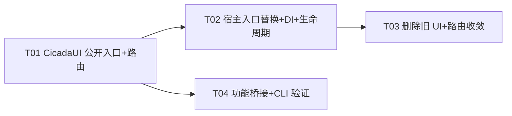

# P4.2 控制中心迁移接入 Spec

> 增量接入：把 CicadaUI（SwiftPM）已建好的控制中心新 UI（`ControlCenterRoot` / `MenuBarDropdown`）接进 Xcode 宿主 Sentry，替换旧 `ContentView` / `SentinelMenuBarView` / `SentryControlCenterView`，统一路由与依赖注入。
>
> 架构师：高见远 ｜ 主理人：齐活林 ｜ 前置：P4 警戒桥接 + NotchDrop 接入（已 review 通过）

---

## 1. 实现方案 + 框架选型

### 一句话结论

**保持 P4 既定方案 C（CicadaUI 纯 SwiftUI 内容层，窗口外壳留宿主），本轮只做「公开入口 + 共享路由 + 单例注入 + 旧壳替换/删除」四件事，不引入任何新框架、不改 P4 已通过的警戒桥接。**

### 关键决策（基于对宿主与 CicadaUI 源码的实查）

实查后发现 **3 个阻断性问题**，必须在动手前明确：

1. **CicadaUI 的入口视图全部是 `internal`，宿主根本 `import` 不到。**
   - `ControlCenterRoot` / `MenuBarDropdown` / `NavSection` / `OverviewPane` / `SettingsPane` / `MaintenancePane` / `SettingsTab` 及全部 Component 均为 `internal`。
   - 当前只有 `AppModel`、`ConfigModel`、`AlarmModel` 是 `public`。
   - **决策**：本轮把「宿主要直接引用的入口类型」加 `public`——`ControlCenterRoot`、`MenuBarDropdown`、`NavSection`、新增的 `ControlCenterRouter`。其余 Pane/Component 作为内部实现细节保持 `internal`（`ControlCenterRoot` 内部引用它们，Swift 允许 public struct 的 body 用 internal 类型，只要不泄露到 public API 签名）。
   - ⚠️ 工程师需注意：`ControlCenterRoot`/`MenuBarDropdown` 的 `#Preview` 与 `@EnvironmentObject` 不受影响；只要 `body` 内部用到的 internal 类型不出现在 public init 参数 / public 存储属性即可。

2. **`MenuBarDropdown` 的窗口 id 与宿主不一致 + 退出用 `exit(0)`。**
   - CicadaUI 三处 `openWindow(id: "control-center")`，宿主 `WindowGroup(id: "main")`——id 不匹配，按钮点了不开窗。
   - `exit(0)` 跳过 `applicationWillTerminate`，会漏掉 P4 已接好的 `stopPolling()` / `SentinelNotifierServer.stop()` / `NotchDropCoordinator.stop()` / `disconnectFromSleepHold()` 清理。
   - **决策**：`MenuBarDropdown` 改用宿主窗口 id `"main"`；退出改为可注入闭包 `public var onQuit: () -> Void`（CicadaUI 默认仍 `exit(0)` 保持库独立可测），宿主注入 `{ NSApp.terminate(nil) }` 走正常终止链路。CicadaUI 仍 `不 import AppKit`。

3. **`ControlCenterRoot` 的选中态是 `@State private`，宿主 commands 无法外部驱动；存在与旧 `SentryControlCenterRouter` 双路由冲突风险。**
   - 旧 `SentryControlCenterRouter.shared.open(.settings)` = 设 `selection` + `SentinelController.shared.openMainWindow()`。
   - `ControlCenterRoot` 的 `@State private var selection` 是本地状态，commands 的「Settings…」「Maintenance」菜单项无法把侧栏切到对应分区。
   - **决策**：在 CicadaUI 新增 `public final class ControlCenterRouter: ObservableObject`（`@Published public var selection: NavSection?`），`ControlCenterRoot` 改为 `@EnvironmentObject var router: ControlCenterRouter`，`List(selection: $router.selection)`。宿主持单例 `ControlCenterRouter.shared`（host 扩展），commands 调用 host 扩展的 `open(_:)`（设 selection + `SentinelController.shared.openMainWindow()`）。**删除旧 `SentryControlCenterRouter` / `SentryControlSection` / `SentryControlCenterView`，消除双路由。**

### 其余约定（遵循项目 MEMORY，不推翻）

- 方案 C：CicadaUI 只写纯 SwiftUI 内容层，窗口外壳（`WindowGroup` / `MenuBarExtra` / `MainWindowOpenBridge`）留宿主。
- `@Observable` 不采用，继续 `ObservableObject` + `@Published`。
- `AppModel.shared` 单例放宿主扩展（P4 已建），**不**把单例塞进 CicadaUI 库本身。
- 部署目标 macOS 14。
- 保留 ColorfulX + SkyLightWindow + Pow + LaunchAtLogin。

---

## 2. 文件列表及相对路径

> 根目录 `/Users/dora-k/Workspace/Project/Cicada`。
> `[C]` = CicadaUI（`apps/agent/swift/Sources/CicadaUI/`），`[H]` = 宿主（`apps/agent/native/sentinel-app/Sentry/`）。

### 2.1 新建

| 路径 | 侧 | 说明 |
|------|----|------|
| `apps/agent/swift/Sources/CicadaUI/State/ControlCenterRouter.swift` | [C] | `public final class ControlCenterRouter: ObservableObject`，`@Published public var selection: NavSection?`。CicadaUI 内纯路由状态，不含宿主依赖。 |
| `apps/agent/native/sentinel-app/Sentry/ControlCenterRouter+Host.swift` | [H] | `extension ControlCenterRouter { static let shared = ControlCenterRouter(); @discardableResult func open(_ section: NavSection = .overview) -> SentinelCommandResult }`——`open` 设 `selection` 后调 `SentinelController.shared.openMainWindow()`。镜像旧 `SentryControlCenterRouter.open`。 |

### 2.2 修改

| 路径 | 侧 | 改动 |
|------|----|------|
| `apps/agent/swift/Sources/CicadaUI/Models/NavSection.swift` | [C] | `enum NavSection` → `public enum NavSection`；各 computed property 加 `public`。供 `ControlCenterRouter` / 宿主 commands 引用。 |
| `apps/agent/swift/Sources/CicadaUI/Views/ControlCenterRoot.swift` | [C] | `struct ControlCenterRoot` → `public struct ControlCenterRoot`；新增 `@EnvironmentObject var router: ControlCenterRouter`；`List(NavSection.allCases, selection: $router.selection)`；`public init() {}`。 |
| `apps/agent/swift/Sources/CicadaUI/Views/MenuBar/MenuBarDropdown.swift` | [C] | `struct MenuBarDropdown` → `public struct MenuBarDropdown`；新增 `public var onQuit: () -> Void`（默认 `{ exit(0) }`）与 `public init(onQuit:)`；新增 `@EnvironmentObject var router: ControlCenterRouter`；三个导航按钮先设 `router.selection = .overview/.settings/.maintenance` 再 `openWindow(id: "main")`；退出按钮调 `onQuit()`。 |
| `apps/agent/native/sentinel-app/Sentry/App.swift` | [H] | `WindowGroup(id:"main")` 内容 `ContentView()` → `ControlCenterRoot()`，追加 `.environmentObject(AppModel.shared).environmentObject(ControlCenterRouter.shared)`（保留 `.environmentObject(appDelegate)`，新 UI 不依赖它但保留无害）；`MenuBarExtra` 内容 `SentinelMenuBarView()` → `MenuBarDropdown(onQuit: { NSApp.terminate(nil) })`，`.environmentObject(AppModel.shared).environmentObject(ControlCenterRouter.shared)`；commands 三处 `SentryControlCenterRouter.shared.open(.x)` → `ControlCenterRouter.shared.open(.x)`；保留 `MainWindowOpenBridge`、`.windowStyle(.hiddenTitleBar)`、`.windowResizability(.contentMinSize)`。 |
| `apps/agent/native/sentinel-app/Sentry/AppDelegate.swift` | [H] | `applicationDidFinishLaunching` 末尾追加 1 行：`ViewModel.shared.setTimerCallback { SentinelController.shared.handleTimerTick() }`（迁移自 `ContentView.onAppear` 的定时器回调接线）。其余不变（`startPolling`/`stopPolling` 已在）。 |
| `apps/agent/native/sentinel-app/Sentry/ContentView.swift` | [H] | **删除 `ContentView` 结构体**，**保留 `ViewModel` 类**（`SentinelController` 深度依赖 `ViewModel.shared` + `PanelStatus`）。建议把文件重命名/精简为 `ViewModel.swift`（仅留 `ViewModel` 类与 `#Preview` 容器）。 |

### 2.3 删除

| 路径 | 侧 | 理由 |
|------|----|------|
| `apps/agent/native/sentinel-app/Sentry/SentryControlCenterView.swift` | [H] | 旧控制中心（`SentryControlSection` + `SentryControlCenterRouter` + `SentryControlCenterView` 及其私有 Pane/Section）整体被 `ControlCenterRoot` 替换。`SentryControlSection` 与 `NavSection` 重复，`SentryControlCenterRouter` 与 `ControlCenterRouter` 重复——删之以消双路由。⚠️ 删除前确认其内部 `SentryRelaySettingsSection`/`SentryAlarmSettingsSection`/`SentryNotificationSettingsSection`/`SentryRecordingSettingsSection`/`NotchDropSettingsSection` 的功能已在 CicadaUI `ConnectionCard`/`ProtectionCard`/`AlertsCard`/`RecordingCard`/`NotchDropCard` 覆盖（见 §8 待明确）。 |
| `apps/agent/native/sentinel-app/Sentry/SentinelMenuBarView.swift` | [H] | 旧菜单栏，被 `MenuBarDropdown` 替换。 |

### 2.4 不动（P4 已 review 通过，本轮不碰）

`AppModel+Shared.swift`（`AppModel.shared` 已建）、`SentinelController.swift`、`Sentry+AlarmEngineDelegate.swift`、`NotchViewModel+Delegate.swift`、`SentryView.swift`、`NotchContentView.swift`、`pbxproj`（`XCLocalSwiftPackageReference "../../swift"` + `CicadaUI` product 依赖已配好，`MACOSX_DEPLOYMENT_TARGET=14.0`）。

---

## 3. 数据结构和接口

### 3.1 新增/改造的 public 签名（CicadaUI）

```swift
// apps/agent/swift/Sources/CicadaUI/Models/NavSection.swift
public enum NavSection: String, Hashable, CaseIterable, Identifiable {
    case overview, settings, maintenance
    public var id: String { rawValue }
    public var title: String { /* 概览/设置/维护 */ }
    public var systemImage: String { /* eye / slider.horizontal.3 / wrench.and.screwdriver */ }
    public var statusText: String { /* 运行中/就绪/睡眠保持空闲 */ }
}

// apps/agent/swift/Sources/CicadaUI/State/ControlCenterRouter.swift  (新建)
@MainActor
public final class ControlCenterRouter: ObservableObject {
    @Published public var selection: NavSection? = .overview
    public init() {}
}

// apps/agent/swift/Sources/CicadaUI/Views/ControlCenterRoot.swift
public struct ControlCenterRoot: View {
    @EnvironmentObject var appModel: AppModel          // 已有，保持
    @EnvironmentObject var router: ControlCenterRouter // 新增
    public init() {}
    // body: NavigationSplitView { List(NavSection.allCases, selection: $router.selection) {...} } detail: { switch router.selection }
}

// apps/agent/swift/Sources/CicadaUI/Views/MenuBar/MenuBarDropdown.swift
public struct MenuBarDropdown: View {
    @EnvironmentObject var appModel: AppModel          // 已有
    @EnvironmentObject var router: ControlCenterRouter // 新增
    @Environment(\.openWindow) private var openWindow
    public var onQuit: () -> Void                      // 新增，默认 { exit(0) }
    public init(onQuit: @escaping () -> Void = { exit(0) }) {
        self.onQuit = onQuit
    }
    // 三个导航按钮: router.selection = .overview/.settings/.maintenance; openWindow(id: "main")
    // 退出按钮: onQuit()
}
```

### 3.2 宿主侧单例与桥接

```swift
// apps/agent/native/sentinel-app/Sentry/ControlCenterRouter+Host.swift  (新建)
import CicadaUI
extension ControlCenterRouter {
    static let shared = ControlCenterRouter()

    @discardableResult
    func open(_ section: NavSection = .overview) -> SentinelCommandResult {
        selection = section
        return SentinelController.shared.openMainWindow()
    }
}
```

> `ControlCenterRouter.shared` 放宿主扩展而非 CicadaUI，理由同 `AppModel.shared`：单例是宿主编排决策，库不应假定「宿主唯一实例」语义。

### 3.3 AppModel.shared 注入点（P4 已建，本轮确认）

| 消费方 | 取法 | 说明 |
|--------|------|------|
| `ControlCenterRoot` | `@EnvironmentObject`，宿主 `App.swift` 注入 `AppModel.shared` | 新主窗口内容 |
| `MenuBarDropdown` | `@EnvironmentObject`，宿主 `App.swift` 注入 `AppModel.shared` | 新菜单栏 |
| `SentinelController`（P4） | 直接 `AppModel.shared.alarm` | 非 Scene 代码，环境不可达 |
| `AppDelegate`（P4） | `AppModel.shared.startPolling()/stopPolling()` | 生命周期 |

### 3.4 路由 enum 对齐

旧 `SentryControlSection`（overview/settings/maintenance）与新 `NavSection`（overview/settings/maintenance）**case 完全一致**，直接用 `NavSection` 替换，commands 的 `.overview/.settings/.maintenance` 调用方仅需把类型 `SentryControlCenterRouter` → `ControlCenterRouter`，语义不变。

### 3.5 类图

见 `docs/P4.2-class-diagram.mermaid`。

---

## 4. 程序调用流程

### 4.1 启动 → 渲染 → 导航（时序）

见 `docs/P4.2-sequence-diagram.mermaid`。文字版：

1. **App 启动**：`@NSApplicationDelegateAdaptor` 创建 `AppDelegate`；SwiftUI Scene 求值 `App.body`。
2. **`AppDelegate.applicationDidFinishLaunching`**：
   - `NSApp.setActivationPolicy(.accessory)`
   - `AppModel.shared.startPolling()`（P4，3s 轮询 sentinels/sleepHold）
   - **本轮新增**：`ViewModel.shared.setTimerCallback { SentinelController.shared.handleTimerTick() }`（1s 状态机驱动接线，从 `ContentView.onAppear` 迁来）
   - `NotchDropCoordinator.start` / `SentinelIPCServer.start` / `SentinelNotifierServer.start` / `runStartupChecks()`（不变）
3. **`WindowGroup(id:"main")` 渲染**：`ControlCenterRoot().environmentObject(AppModel.shared).environmentObject(ControlCenterRouter.shared).environmentObject(appDelegate)`。
   - `ControlCenterRoot` 读 `router.selection`（默认 `.overview`）→ `NavigationSplitView` 侧栏 `List(NavSection.allCases, selection: $router.selection)` + detail `OverviewPane`/`SettingsPane`/`MaintenancePane`。
   - 各 Pane 通过 `@EnvironmentObject appModel` 取 `appModel.sentinels` / `appModel.config` / `appModel.sleepHold`。
4. **`MenuBarExtra` 渲染**：label `ZStack { Image("eye"); MainWindowOpenBridge() }`（不变，`MainWindowOpenBridge.onAppear` 注册 `SentinelController.shared.registerMainWindowOpener { openWindow(id:"main") }`）；content `MenuBarDropdown(onQuit:{ NSApp.terminate(nil) }).environmentObject(AppModel.shared).environmentObject(ControlCenterRouter.shared)`。
   - `MenuBarDropdown.onAppear` 触发一次 `appModel.sentinels.refresh()`。
5. **用户点菜单栏「设置…」**：`MenuBarDropdown` 设 `router.selection = .settings` → `openWindow(id:"main")` → 主窗口置顶并显示 Settings 分区。
6. **用户点菜单栏「退出 Cicada」**：`onQuit()` → `NSApp.terminate(nil)` → `AppDelegate.applicationWillTerminate` → `AppModel.shared.stopPolling()` / servers.stop() / `disconnectFromSleepHold()` → 退出。
7. **用户点系统菜单「Cicada → Settings」**：`ControlCenterRouter.shared.open(.settings)` → 设 `selection=.settings` + `SentinelController.shared.openMainWindow()`（通过已注册的 `mainWindowOpener` 调 `openWindow(id:"main")`）。
8. **1s 定时器 tick**：`ViewModel.shared.callback()` → `SentinelController.shared.handleTimerTick()` → 按 `viewModel.status` 驱动 welcome→running→completed 状态机（不变）。

### 4.2 关键：为什么路由用单例 + EnvironmentObject 双通道

- `ControlCenterRouter.shared`（单例）：供 commands（Scene 外的 `Button` action）与 `SentinelController` 等非 SwiftUI 代码设 `selection` 并 `openMainWindow`。
- `@EnvironmentObject router`：供 `ControlCenterRoot` / `MenuBarDropdown` 在 View 层响应 `selection` 变化。
- 两者指向**同一个** `ControlCenterRouter.shared` 实例（宿主在 `App.swift` 注入的就是 `.shared`），`@Published selection` 变更自动驱动两端 UI——无双路由、无冲突。

---

## 5. 任务列表（给工程师寇豆码的直接输入）

> 硬约束：≤5 任务，每任务 ≥3 文件，按依赖排序。本轮为增量迁移，T01 为「CicadaUI 公开入口基建」（等价于新项目的项目基础设施：没有它宿主无法 import）。

| ID | 任务名 | 源文件 | 依赖 | 优先级 |
|----|--------|--------|------|--------|
| **T01** | CicadaUI 公开入口 + 共享路由器 + 菜单栏导航改造 | `[C] NavSection.swift`、`[C] State/ControlCenterRouter.swift`(新)、`[C] Views/ControlCenterRoot.swift`、`[C] Views/MenuBar/MenuBarDropdown.swift` | — | P0 |
| **T02** | 宿主 App 入口替换 + 依赖注入 + 生命周期迁移 | `[H] App.swift`、`[H] AppDelegate.swift`、`[H] ContentView.swift`(→`ViewModel.swift` 精简)、`[H] ControlCenterRouter+Host.swift`(新) | T01 | P0 |
| **T03** | 删除旧 UI + 路由收敛验证 | `[H] SentryControlCenterView.swift`(删)、`[H] SentinelMenuBarView.swift`(删)、`[H] App.swift`(复查 commands 引用)、`[H] 全局 grep 残留 `SentryControlCenterRouter`/`SentryControlSection`/`SentinelMenuBarView`/`SentryControlCenterView`) | T01, T02 | P0 |
| **T04** | CicadaUI 功能性桥接补齐 + CLI 验证 | `[C] Views/Maintenance/FolderGrid.swift`(注入 actions)、`[C] Views/SettingsCards/NotchDropCard.swift`(@AppStorage key 对齐确认)、`[C] Views/MaintenancePane.swift`(诊断按钮复核)、运行 `swift build`/`swift test` | T01 | P2 |

### T01 细节（CicadaUI 公开入口 + 路由）
1. `NavSection`：`enum`→`public enum`，`id/title/systemImage/statusText` 加 `public`。
2. 新建 `State/ControlCenterRouter.swift`：`@MainActor public final class ControlCenterRouter: ObservableObject { @Published public var selection: NavSection? = .overview; public init() {} }`。
3. `ControlCenterRoot`：`struct`→`public struct`；加 `@EnvironmentObject var router: ControlCenterRouter`；`@State private var selection` 删除，`List` 与 `switch` 全部改用 `router.selection`；补 `public init() {}`。
4. `MenuBarDropdown`：`struct`→`public struct`；加 `@EnvironmentObject var router: ControlCenterRouter`；加 `public var onQuit: () -> Void` + `public init(onQuit: @escaping () -> Void = { exit(0) })`；「打开控制中心/设置…/维护…」三按钮分别 `router.selection = .overview/.settings/.maintenance` 后 `openWindow(id: "main")`（**id 从 `"control-center"` 改 `"main"`**）；「退出 Cicada」按钮 `onQuit()`。
5. 不改 `AppModel`（已 public）、不改 Pane/Component（保持 internal）。

### T02 细节（宿主入口 + DI + 生命周期）
1. `App.swift` `WindowGroup(id:"main")`：内容 `ContentView()` → `ControlCenterRoot()`；`.environmentObject(appDelegate)` 之后追加 `.environmentObject(AppModel.shared).environmentObject(ControlCenterRouter.shared)`。
2. `App.swift` `MenuBarExtra` content：`SentinelMenuBarView()` → `MenuBarDropdown(onQuit: { NSApp.terminate(nil) })`；`.environmentObject(appDelegate)` → `.environmentObject(AppModel.shared).environmentObject(ControlCenterRouter.shared)`；label `ZStack { Image("eye"); MainWindowOpenBridge() }` **保持不变**。
3. `App.swift` commands：3 处 `SentryControlCenterRouter.shared.open(.x)` → `ControlCenterRouter.shared.open(.x)`（`.overview`/`.settings`/`.maintenance`）。
4. `AppDelegate.swift` `applicationDidFinishLaunching`：在 `AppModel.shared.startPolling()` 之后追加 `ViewModel.shared.setTimerCallback { SentinelController.shared.handleTimerTick() }`。
5. `ContentView.swift` → 删除 `ContentView` 结构体与 `ContentViewPreviewContainer`，仅留 `ViewModel` 类（与 `#Preview` 若需要可删预览）。建议重命名文件为 `ViewModel.swift`（Xcode 里 rename，保持 target membership）。
6. 新建 `ControlCenterRouter+Host.swift`：`extension ControlCenterRouter { static let shared = ControlCenterRouter(); @discardableResult func open(_ section: NavSection = .overview) -> SentinelCommandResult { selection = section; return SentinelController.shared.openMainWindow() } }`。

### T03 细节（删除旧 UI + 收敛）
1. 删 `SentryControlCenterView.swift`、`SentinelMenuBarView.swift`（从 Xcode target 移除 + 删文件）。
2. 全局 grep 确认无残留引用：`SentryControlCenterRouter`、`SentryControlSection`、`SentryControlCenterView`、`SentinelMenuBarView`、`ContentView`（作为类型）。`ContentView` 若 `App.swift` 已不引用即可。
3. Xcode GUI 打开 `Sentry.xcodeproj`，确认 target 编译（CLI 完整 build 因 ColorfulX 传递依赖在 Xcode 26.3 不可过，见 §8）。

### T04 细节（功能性桥接 + CLI 验证）
1. `FolderGrid.swift`：当前 6 个 `FolderAction` 闭包全空 `{}`，旧 `SentryMaintenancePane` 的「打开录像文件夹/打开 NotchDrop 文件夹/清空托盘/运行启动检查」功能丢失。把 `folderActions` 改为可注入：`public var actions: [FolderAction] = FolderGrid.defaultActions`（默认仍空闭包，保持库独立），宿主在 `MaintenancePane` 或 host 注入实际 `NSWorkspace` 行为。**此项需工程师与主理人确认是否纳入本轮**（见 §8 待明确）。
2. `NotchDropCard.swift`：核对 `@AppStorage` key（`notch.hapticFeedback`/`notch.fileRetentionDays`/`notch.interfaceLanguage`）与旧 `NotchDropSettingsStore` 的 `@PublishedPersist` key（`hapticFeedback`/`selectedLanguage`/`selectedFileStorageTime`）是否冲突或丢失旧持久化值。**确认是否需要 key 迁移**（见 §8）。
3. CLI 验证：`cd apps/agent/swift && export DEVELOPER_DIR=/Applications/Xcode.app/Contents/Developer && swift build` 与 `swift test`（CicadaUI 单测可过）。

### 任务依赖图

见 `docs/P4.2-task-graph.mermaid`（内联于本文件下方）。

---

## 6. 依赖包列表

**本轮不新增任何第三方依赖。**

- `CicadaUI` SwiftPM 包已在 P4 通过 `XCLocalSwiftPackageReference("../../swift")` 接入宿主，product `CicadaUI` 已在 `packageProductDependencies`。
- 保留 ColorfulX / SkyLightWindow / Pow / LaunchAtLogin / MSDisplayLink（本轮不碰）。

---

## 7. 共享知识（跨文件约定，给工程师）

1. **单例用法**：`AppModel.shared`、`ControlCenterRouter.shared`、`SentinelController.shared`、`ViewModel.shared` 均为宿主侧单例（前两者 host extension 定义，后两者 host 类定义）。CicadaUI 库内**不**定义单例。
2. **环境注入**：`App.swift` 的 `WindowGroup(id:"main")` 与 `MenuBarExtra` content 都必须注入 `.environmentObject(AppModel.shared).environmentObject(ControlCenterRouter.shared)`；`ControlCenterRoot` / `MenuBarDropdown` 通过 `@EnvironmentObject` 取用。**漏注入会运行时崩溃**（`ControlCenterRoot`/`MenuBarDropdown` 强依赖两者）。
3. **路由桥接约定**：所有「打开某分区」入口（系统菜单 commands、菜单栏按钮、未来 openWindow 调用）统一走 `ControlCenterRouter.shared.open(.section)`——它先设 `selection` 再 `SentinelController.shared.openMainWindow()`。**禁止**再引入第二个 router。
4. **窗口 id**：宿主唯一主窗口 id 是 `"main"`。CicadaUI `MenuBarDropdown` 已改用 `"main"`。`MainWindowOpenBridge` 注册的 `mainWindowOpener`（`openWindow(id:"main")`）是 `SentinelController.openMainWindow()` 的底层执行器，保持不变。
5. **定时器回调位置**：1s `ViewModel` 定时器（状态机驱动）的 `handleTimerTick` 接线从 `ContentView.onAppear` 迁到 `AppDelegate.applicationDidFinishLaunching`，**一次性接线、全程生效**。3s `AppModel` 轮询（状态刷新）是另一条独立链路，两者不混淆：1s 驱动 lock 状态机，3s 拉 IPC 快照。
6. **退出链路**：`MenuBarDropdown.onQuit` 宿主注入 `{ NSApp.terminate(nil) }`，确保 `applicationWillTerminate` 的 `stopPolling`/`servers.stop`/`disconnectFromSleepHold` 执行。**禁止**在 CicadaUI 侧直接 `exit(0)`（库默认值仅用于独立预览/单测）。
7. **保留不动**：P4 警戒桥接（`Sentry+AlarmEngineDelegate`/`NotchViewModel+Delegate`/`SentryView`/`NotchContentView`/`SentinelController` 的 alarm 部分）、`MainWindowOpenBridge`、`.windowStyle(.hiddenTitleBar)`、`.windowResizability(.contentMinSize)`、`AppModel+Shared.swift`。
8. **构建环境**：CLI 构建/测试前必须 `export DEVELOPER_DIR=/Applications/Xcode.app/Contents/Developer`（本机 `xcode-select` 默认指 CommandLineTools，否则 `#Preview` 宏缺失报错）。

---

## 8. 待明确事项（UNCLEAR）

1. **CLI 构建边界（重要）**：CicadaUI 的 `swift build` / `swift test` 在本机可过（`export DEVELOPER_DIR=...` 后）。但 **Sentry target 完整 `xcodebuild build` 在本机 Xcode 26.3 CLI 过不去**——卡在既有第三方依赖 ColorfulX（`no such module 'ColorVector'` 等传递依赖缺失，Xcode 26.3 CLI 构建 SPM 传递依赖的缺陷，ColorfulX 是本轮没碰的既有依赖）。**结论：Sentry target 完整构建的真实闸口在 Xcode GUI**（华哥手动打开 `Sentry.xcodeproj` 编译运行）。spec 的 T03/T04 验证步骤需据此设定预期：CLI 只验 CicadaUI，Sentry 整体 build + 截图对照需 GUI。

2. **截图验收需 GUI**：控制中心新 UI 的视觉对照（与 `docs/Design.md` 设计稿）只能在 Xcode GUI 运行 Sentry 后截图，CLI 无法产出。QA 任务（T3）的「设计稿对照」依赖华哥手动出截图。

3. **删除文件需主理人确认**：`SentryControlCenterView.swift` 内含 `SentryRelaySettingsSection`/`SentryAlarmSettingsSection`/`SentryNotificationSettingsSection`/`SentryRecordingSettingsSection`/`NotchDropSettingsSection` 等私有 Section，删除前需确认其功能已被 CicadaUI `ConnectionCard`/`ProtectionCard`/`AlertsCard`/`RecordingCard`/`NotchDropCard` 覆盖（实查看 CicadaUI 卡片已具备连接/防护/告警/录像/NotchDrop 的 UI，但**字段与旧 Section 的绑定路径不同**：旧 Section 直写 `SentryConfigurationManager.shared.cfg.*`，新 Card 走 `appModel.config.sentry.*`——两套存储底层都是 `SentryConfigStore`(~/.cicada/sentry-config.json)，但 `ConfigModel` 会重新 `load()`，需确认不会覆盖/丢失既有配置）。**建议工程师删文件前先 diff 功能清单。**

4. **FolderGrid 功能回归**：新 `MaintenancePane` 的 `FolderGrid` 6 个按钮闭包全空，旧「打开录像文件夹/打开 NotchDrop 文件夹/清空托盘/运行启动检查」功能丢失。是否纳入本轮（T04）由主理人定。若不纳入，需在 UI 上把这些按钮隐藏或加「即将上线」占位，避免点了无反应。

5. **NotchDrop 设置 key 迁移**：旧 `NotchDropSettingsStore` 用 `@PublishedPersist(key:"hapticFeedback"/"selectedLanguage"/"selectedFileStorageTime")`，新 `NotchDropCard` 用 `@AppStorage("notch.hapticFeedback"/"notch.fileRetentionDays"/"notch.interfaceLanguage")`——key 名与语义均不同（旧有 `selectedFileStorageTime` 枚举+custom 时长，新只有 `fileRetentionDays` 整数）。既有用户的 NotchDrop 偏好不会自动迁移，需主理人决定是否做迁移或接受重置。

6. **`@AppStorage("launchAtLogin")` vs `LaunchAtLogin.Toggle`**：新 `MaintenancePane` 用 `@AppStorage("launchAtLogin")` + 普通 `Toggle`，旧 `SentryMaintenancePane` 用 `LaunchAtLogin.Toggle`（第三方库，写 SMLoginItemSetEnabled）。两者机制不同——新写法只是存一个布尔，**不会真正注册开机自启**。需主理人确认是否保留 `LaunchAtLogin.Toggle`（本轮 spec 倾向保留旧实现，T04 把 `MaintenancePane` 的 Toggle 换回 `LaunchAtLogin.Toggle`，但这需要 CicadaUI 依赖 LaunchAtLogin——与「CicadaUI 不 import AppKit 系宿主依赖」原则冲突，可能需宿主注入）。**暂列为待明确，默认不动（接受新 UI 用 @AppStorage 占位，自启功能留后续）。**

---

## 附：任务依赖图（Mermaid）

