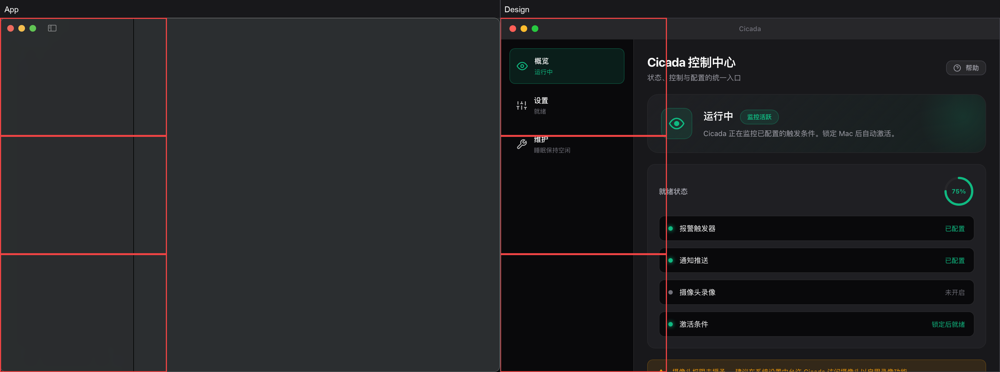
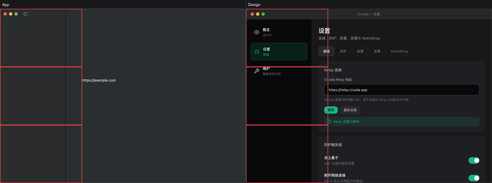
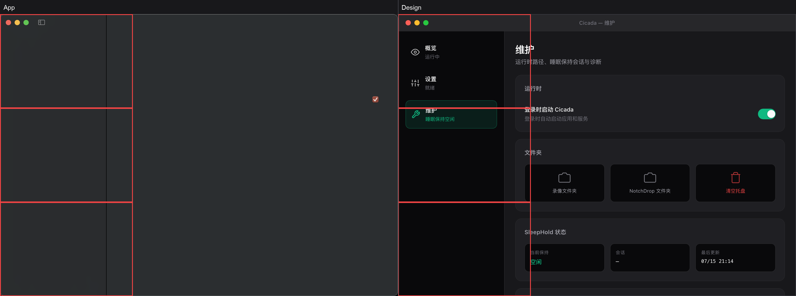
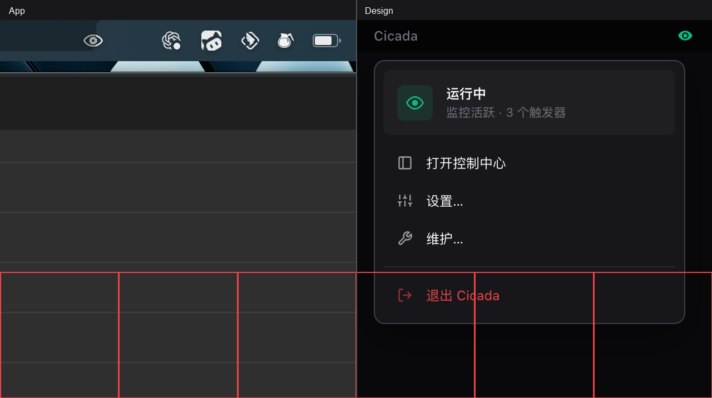

# Cicada 新控制中心 UI 视觉验收报告

> 生成时间：2026-07-17T00:52:18+08:00
> 判定口径：单像素最大 RGB 差值 >24 计为差异；差异像素 ≤5% 且平均 RGB 差值 ≤8 才判为“一致”。

## 结论总览

| 画面 | 结论 | 差异像素 | 平均 RGB 差值 | 主要热点 |
| --- | --- | ---: | ---: | --- |
| 控制中心 Overview | 有差异 | 43.7% | 24.57 | 左下、左中、左上 |
| 控制中心 Settings | 有差异 | 30.9% | 21.84 | 左中、左下、左上 |
| 控制中心 Maintenance | 有差异 | 39.8% | 23.46 | 左中、左下、左上 |
| 菜单栏下拉 | 有差异 | 41.9% | 31.40 | 右下、左下、下中 |

## 分屏检查

### 控制中心 Overview

**结论：有差异。** 差异像素 43.7%，平均 RGB 差值 24.57，主要集中在左下、左中、左上；人工复核重点：Hero 状态卡、Readiness 进度环、诊断条、版本标签及侧栏选中态。
疑似差异点：App 内容密度显著低于设计稿，疑似存在大面积未渲染或缺失区域。



### 控制中心 Settings

**结论：有差异。** 差异像素 30.9%，平均 RGB 差值 21.84，主要集中在左中、左下、左上；人工复核重点：连接 Tab、设置子导航、卡片数量、字段间距、按钮与内联反馈。
疑似差异点：App 内容密度显著低于设计稿，疑似存在大面积未渲染或缺失区域。



### 控制中心 Maintenance

**结论：有差异。** 差异像素 39.8%，平均 RGB 差值 23.46，主要集中在左中、左下、左上；人工复核重点：运行时开关、文件夹网格、SleepHold 数据卡、诊断按钮与结果条。
疑似差异点：App 内容密度显著低于设计稿，疑似存在大面积未渲染或缺失区域。



### 菜单栏下拉

**结论：有差异。** 差异像素 41.9%，平均 RGB 差值 31.40，主要集中在右下、左下、下中；人工复核重点：状态卡、280pt 下拉宽度、三个导航操作、分隔线与退出按钮。



## 疑似不一致项复核说明

- 控制中心 Overview：App 内容密度显著低于设计稿，疑似存在大面积未渲染或缺失区域。
- 控制中心 Settings：App 内容密度显著低于设计稿，疑似存在大面积未渲染或缺失区域。
- 控制中心 Maintenance：App 内容密度显著低于设计稿，疑似存在大面积未渲染或缺失区域。
- 菜单栏下拉：主要像素热点为右下、左下、下中；重点复核状态卡、280pt 下拉宽度、三个导航操作、分隔线与退出按钮。

- 红框表示 3×3 网格中差异比例最高的区域，只定位像素热点，不替代语义判断。
- 实时状态、版本号、触发器数量和诊断文案参与差异计算；这些内容变化会被保守标记为疑似差异。
- HTML mockup 与 SwiftUI 的字体栅格化、系统材质和原生标题栏差异不会被自动豁免。

## 本次不在对照范围

- NotchDrop key 不迁移。
- RecordingCard 相机预览仍为占位。
- Relay 配置模型差异。
- 诊断数据源不同。

## 重跑

```bash
DEVELOPER_DIR=/Applications/Xcode.app/Contents/Developer ./scripts/visual-acceptance/run-all.sh
```

若 GUI 自动化失败，请先在“系统设置 → 隐私与安全性”中为执行脚本的 Terminal/Codex 开启“辅助功能”和“屏幕录制”，然后重跑。
